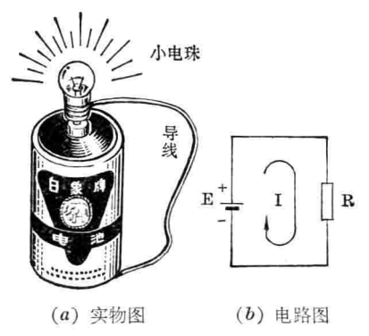

# 电路

[TOC]

## 概述

**电路**是为了完成某种功能，将电气元件或设备按照一定方式连接起来而形成的系统，其核心作用是构成电流的通路。

---

## 组成

| 部分 | 功能 | 示例 |
|------|------|------|
| **电源** | 供给电路电能的设备。将化学能、光能、机械能等非电能转换为电能 | 电池、发电机、光伏板、开关电源 |
| **负载** | 用电设备，将电能转换为其他形式的能量 | 灯泡（→光能）、电机（→机械能）、扬声器（→声能） |
| **中间环节** | 连接电源与负载，起传输/分配电能或传递/处理电信号的作用 | 导线、开关、继电器、变压器 |

---

## 电路作用

1. **电能的传输、分配与转换** —— 电力系统（发电 → 输电 → 配电 → 用电）
2. **信息的传递和处理** —— 电子设备（放大、运算、存储、通信）

---

## 电路的状态

| 状态 | 特征 | 说明 |
|------|------|------|
| **通路（闭路）** | 电源 → 负载形成完整回路 | 正常工作状态 |
| **断路（开路）** | 回路中某处断开，电流为零 | 开关断开、导线断裂、保险丝熔断 |
| **短路** | 电源两端不经负载直接接通 | 电流极大，会烧毁电源/导线 → 火灾风险 |

---

## 模拟电路与数字电路

### 模拟电路

工作信号为**模拟信号**（在时间与幅度上均连续变化）的电子电路。

- 特点：信号连续、易受噪声干扰、对元件精度要求高
- 处理功能：放大、滤波、调制、振荡、变换
- 典型应用：音频功放、射频前端、传感器信号调理

### 数字电路

工作信号为**数字信号**（仅有两个离散电平：高/低）的电子电路。

- 特点：抗干扰性强、便于存储/处理、易于大规模集成
- 处理功能：逻辑运算、计数、存储、运算
- 典型应用：处理器、存储器、FPGA、通信基带

| | 模拟电路 | 数字电路 |
|---|---|---|
| 信号 | 连续 (如 0~5V) | 离散 (0/1) |
| 抗干扰 | 弱（噪声叠加在信号上） | 强（噪声容限大） |
| 精度 | 受元件偏差影响 | 几乎不受影响（只要逻辑正确） |
| 功耗优化 | 较困难 | 容易（CMOS 静态功耗极低） |
| 典型 IC | 运算放大器、ADC/DAC | 门电路、MCU、CPU |

---

## 基本电路分析方法

### 串联电路

| 特征 | 规律 |
|------|------|
| 电流 | 各处电流相等：I = I₁ = I₂ |
| 电压 | 总电压 = 各段电压之和：U = U₁ + U₂ |
| 电阻 | 总电阻 = 各电阻之和：R = R₁ + R₂ |
| 分压 | U₁ / U₂ = R₁ / R₂ |

### 并联电路

| 特征 | 规律 |
|------|------|
| 电压 | 各支路电压相等：U = U₁ = U₂ |
| 电流 | 总电流 = 各支路电流之和：I = I₁ + I₂ |
| 电阻 | 1/R = 1/R₁ + 1/R₂（总电阻小于各分支中最小电阻） |
| 分流 | I₁ / I₂ = R₂ / R₁（电流与电阻成反比） |

### 混联电路

同时包含串联与并联，计算时**从最末端向上逐步等效化简**。

---

## 常见电路拓扑

| 拓扑 | 描述 | 用途 |
|------|------|------|
| 分压电路 | 两电阻串联分压 | 产生基准电压、电平转换 |
| RC 电路 | 电阻 + 电容 | 定时、滤波、微分/积分 |
| LC 电路 | 电感 + 电容 | 选频、振荡、滤波 |
| 桥式电路 | 四臂结构（惠斯通电桥） | 精密电阻测量、传感器检测 |
| 推挽电路 | 互补上下管交替导通 | 功率放大、电机驱动 |
| 差动电路 | 两输入端，放大差值 | 运放输入级、抗干扰 |

---

## 电路图的种类

| 种类 | 用途 | 说明 |
|------|------|------|
| 原理图 (Schematic) | 表达电路工作原理 | 符号化表示，不反映实物布局 |
| 方框图 (Block Diagram) | 表达系统功能结构 | 以方框表示功能模块 |
| 接线图 (Wiring Diagram) | 指导实际安装接线 | 接近实物连接方式 |
| 印制板图 (PCB Layout) | 制造 PCB 使用 | 反映走线、焊盘、过孔 |

---

## 常用电路仿真工具

| 软件 | 类型 | 特点 |
|------|------|------|
| LTspice | 免费 SPICE 仿真 | 开关电源仿真 |
| Multisim | 商业 SPICE | 教学用、虚拟仪器丰富 |
| PSIM | 电力电子仿真 | 开关电源、电机驱动 |
| KiCad | 开源 EDA | 原理图 + PCB + 3D |
| Altium Designer | 商业 EDA | 工业级一体设计 |
