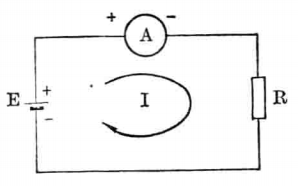

# 电流

[TOC]

## 概述

物体带电的多少可用**电荷量**（电量）来表示，用字母 **Q** 表示，单位是**库仑 (C)**。每库仑电量相当于 6.25 × 10¹⁸ 个电子所带的电荷量。

**电荷的有规则运动形成电流。**

**电流强度**（简称电流）是电荷流经一点的流量速率，即单位时间内通过导体横截面的电荷量：

$$
\Huge I = \frac{Q}{t}
$$

1 A 的电流 = 每秒有 1 C 的电荷通过导体截面。

---

## 电流方向规定

习惯上规定：电路中电流的方向为**正电荷流动的方向**（从高电位 → 低电位）。

> 实际金属导体中，载流子是**自由电子**（带负电），电子从低电位流向高电位，与规定的电流方向**相反**。

在半导体中，N 型半导体以电子导电为主，P 型半导体以空穴（等效正电荷）导电为主。在溶液（电解液）中，正负离子均参与导电。

---

## 符号与单位

**符号**：I（恒定电流）、i（变化电流）

**单位**：安培，安 (A)

| 单位 | 皮安 | 纳安 | 微安 | 毫安 | 安 |
|------|:---:|:---:|:---:|:---:|:---:|
| 符号 | pA | nA | μA | mA | A |
| 指数 (10ⁿ, n 相对于 A) | −12 | −9 | −6 | −3 | 0 |

---

## 测量

使用**电流表**（或万用表电流档）测量电流。电流表必须**串联**在被测支路中。

> 电流表的内阻应尽量小（理想为 0 Ω），否则串入后会影响原电路的工作状态。

---

## 电流分类

### 直流电 (DC)

- 符号：— 或 DC
- 大小和方向均**不随时间变化**的电流
- 恒定电流用大写 I 表示：I = Q / t

### 交流电 (AC)

- 符号：~ 或 AC
- 大小和方向**随时间周期性变化**的电流
- 用小写 i 表示瞬时值周期变化的电流

### 脉动电流

- 方向不变，大小随时间而变化的电流
- 例如全波整流后的波形、脉动直流

### 电流波形示意

| 类型 | 波形特点 |
|------|---------|
| 直流 | 直线 ——— |
| 正弦交流 | 正弦波 ∿ |
| 方波 | 高低交替 |
| 脉动 | 单向波动（半波/全波） |

---

## 电流的效应

电流通过导体时会产生三种效应：

### 热效应

电流通过导体时产生热量：

Q = I² R t  （焦耳定律）

应用：电炉、电烙铁、熔断器；危害：导线过热 → 火灾。

### 磁效应

电流周围产生磁场（奥斯特发现），感应磁场强度正比于电流。

应用：电磁铁、电动机、继电器、电流互感器。

### 化学效应

电流通过电解液时引起化学反应（电离、电镀）。

应用：电镀、电解、电池充电。

---

## 电流密度

**电流密度 J** 是单位截面积上通过的电流：

$$
\Huge J = \frac{I}{A}
$$

- J — 电流密度 (A/m² 或 A/mm²)
- I — 电流 (A)
- A — 导体截面积 (m²)

> 电流密度是选择导线截面的重要依据。电流密度过大导致导线过热。

| 应用场景 | 推荐电流密度 (铜) |
|------|:---:|
| 配电线路 | 1 ~ 3 A/mm² |
| 变压器绕组 | 2 ~ 4 A/mm² |
| 电机绕组 | 4 ~ 8 A/mm² |
| PCB 外层铜箔 (35 μm) | 按线宽 1 mm 可走 ~2 A |

---

## 测量工具与技巧

### 电流表（安培表）

- 串联于被测支路中
- 分直流档和交流档
- 测大电流用**电流互感器 (CT)** 或**分流器**

### 钳形电流表

无需断开电路，将导线钳入即可测量交流 (CT 原理) 或交直流 (霍尔传感器)。详见 [钳形表](仪器仪表/钳形表.md)。

### 万用表测电流注意事项

1. 必须**串联**接入！（误接并联会烧毁保险丝甚至损坏万用表）
2. 测前估算电流大小，从最大量程开始
3. 测量完成后，表笔**必须移回电压插孔**（许多人因此烧表）
4. 大电流不可长时间测量（内部分流器发热）

---

## 电流互感器 (CT, Current Transformer)

将大电流按比例转换为小电流（如 100 A:1 A 或 5 A），供测量仪表和保护装置使用。

> **CT 二次侧不准开路！** 开路时二次侧会产生极高电压，危及安全并击穿绝缘。
