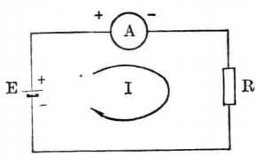

# 电流

[TOC]

## 概述

物体带电的多少可用电荷量来表示，简称电量，用字母 Q 表示。单位是库伦，每库伦电量相当于 6.25 * 1018 个电子所带的电荷量。

电荷的有规则运动形成电流。

电流强度是电荷流经一点的流量速率（单位时间内通过导体横截面的电荷量）。1A 的电流就是每秒 1C 电荷的流动。

根据习惯规定，电路中的电流被认为是正电荷从较正的电位点流向较负的电位点。实际电路中电子流动方向与规定相反。

 

**符号：**I

**单位：**安培  amp  A

| 单位                  | 皮安 pA | 纳安 nA | 微安 μA | 毫安 mA | 安 A |
| --------------------- | ------- | ------- | ------- | ------- | ---- |
| 指数（10^x，相对于A） | -12     | -9      | -6      | -3      | 0    |

**检测：**电流表

 

## 分类

* 直流电

  符号：  -    DC

  大小和方向都不随时间变化的电流，称为恒定电流，用 `I` 表示，`I = Q / t`

  * Q      电量，库伦
  * t        时间，秒

* 交流电

  符号：  ~     AC
  
  大小和方向随时间变化的电流，称为交电流，用 `i` 表示。
  
* 脉动电流

  方向不变，大小随时间而变的电流。

## 方向

 