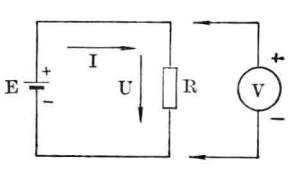

# 电压

[TOC]

## 电位

通常以大地的电位当作零电位。在电子设备中，通常以机壳为零电位。

## 电压

电位差也称电压，在电路中任意两点的电位差称为该两点间的电压。负载两端存在的电位差称为负载的端电压。

两点之间的电压就是将一个单位正电荷从低电位点搬移到高电位点时所做的功（损耗的能量）。等效的看，是一个单位电荷从高电位点向低电位点下降时所释放的能量。

**别名：**电位差  电动势（EMF）

**符号：**U   或   E

**单位：**伏特 V

| 单位                  | 纳伏 nV | 微伏 μV | 毫伏 mV | 伏 V | 千伏 kV | 兆伏 MV |
| --------------------- | ------- | ------- | ------- | ---- | ------- | ------- |
| 指数（10^x，相对于V） | -9      | -6      | -3      | 0    | 3       | 6       |

**测量：**电压表

 

## 电动势

在电源内部所产生的推动电荷流动的力，称为电动势。

方向是从电源负极通过电源内部指向电源正极。

**符号：**E

**单位：**伏特 V

## 安全电压

| 电压|用途|
|-----|---|
| 42V | 手持电动工具（危险环境中） |
| 36V | 局部照明灯具 |
| 24V | 有电击危险环境中使用的手持照明灯具 |
| 12V | 金属容器内，特别潮湿的环境中使用的灯具 |
| 6V  | 水下作业等场所 |
