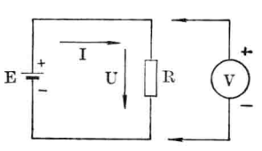

# 电压

[TOC]

## 电位

电路中某一点的电位，等于将该点与选定的参考点（零电位点）之间的电压。

- 通常以**大地**的电位作为零电位参考点
- 电子设备中常以**机壳**或**公共地**为零电位
- 参考点选择不同，同一点的电位数值也不同，但**任意两点间的电位差（电压）不变**

> 电位用 V（画电路图中也常用字母标注），为零电位点接地时也用 GND 标注。

---

## 电压（电位差）

电路中任意两点间的**电位差**即为此两点之间的电压。负载两端存在的电位差称为负载的**端电压**。

### 物理定义

两点之间的电压，等于将一个单位正电荷从低电位点搬移到高电位点时**所做的功**（消耗的能量）。等价地，一个单位电荷从高电位点向低电位点下降时**所释放的能量**。

$$
\Huge U = \frac{W}{Q}
$$

- U — 电压 (V)
- W — 功 / 能量 (J)
- Q — 电荷量 (C)

### 别名

电位差、电动势 (EMF)、电势差、降（压降）

### 符号与单位

**符号**：U（一般电压）、E（电动势）

**单位**：伏特，伏 (V)

| 单位 | 纳伏 | 微伏 | 毫伏 | 伏 | 千伏 | 兆伏 |
|------|:---:|:---:|:---:|:---:|:---:|:---:|
| 符号 | nV | μV | mV | V | kV | MV |
| 指数 (10ⁿ, n 相对于 V) | −9 | −6 | −3 | 0 | 3 | 6 |

---

## 电动势 (EMF, Electromotive Force)

在电源内部，非静电力（化学、电磁感应、光生伏打等）将正电荷从负极移到正极，所做的功与电荷量的比值即为该电源的**电动势**。

- 方向：电源内部从**负极 → 正极**（与外部电路电流方向相反）
- 单位：与电压相同——伏特 (V)
- 当电源**开路**时，电动势 E = 端电压 U
- 当电源带载时有内阻压降，U = E − I · r（r 为内阻）

### 电压与电动势的区别

| | 电压 (U) | 电动势 (E) |
|---|---|---|
| 产生原理 | 电场力推动电荷 | 非静电力搬移电荷 |
| 方向 | 高电位 → 低电位（外电路） | 低电位 → 高电位（电源内部） |
| 产生方式 | 由电动势维持 | 化学、电磁感应等 |

---

## 测量

用**电压表**（或万用表电压档）测量。电压表必须**并联**在被测元件或电路的两端。

> 电压表的内阻应尽量大（理想为 ∞ Ω），避免从被测电路分流电流而导致读数偏低。

### 万用表测电压注意事项

1. 并联接法
2. 从高量程开始逐步降低
3. 直流电注意正、负极性（数字表自动显示负号）
4. 测高压 (≥ 36 V AC / 60 V DC) 注意安全
5. 测市电 220V AC 时打到 ACV 档不能错

---

## 常见电压等级及应用

### 安全电压

人体安全电压与所处环境相关（环境越潮湿，安全电压越低）：

| 电压 | 应用场景 |
|:---:|------|
| 42 V | 手持电动工具（危险环境中） |
| 36 V | 局部照明灯具、一般安全电压 |
| 24 V | 有电击危险环境中使用的手持照明灯具、工业传感器控制电压 |
| 12 V | 金属容器内、特别潮湿环境中使用的灯具、汽车电气系统 |
| 6 V | 水下作业等场所 |

> 国家标准 GB/T 3805 规定了安全电压值。人体电阻约 1000 ~ 2000 Ω（干燥条件），潮湿环境下可降至 500 Ω 以下。

### 常见用电电压

| 电压 | 应用 |
|:---:|------|
| 1.2 ~ 4.2 V | 锂电池 / 镍氢电池 |
| 5 V | USB 供电、TTL 逻辑 |
| 12 V | 汽车电气、LED 灯带、PC 电源 |
| 24 V | 工业控制、PLC 输入输出 |
| 48 V | PoE (网线供电)、通信电源 |
| 110 V / 220 V | 民用电网（美国 110 V 60 Hz / 中国 220 V 50 Hz） |
| 380 V | 三相工业动力电（中国） |
| 10 kV / 35 kV | 中压配电 |
| 110 kV / 220 kV / 500 kV | 高压输电 |
| 800 kV+ | 特高压输电 (UHV) |

---

## 电压源

### 理想电压源

- 端电压恒定，与输出电流无关
- 内阻为零

### 实际电压源

- 存在内阻 r，带载时端电压下降：U = E − I · r
- 干电池：内阻随放电增大，电压逐渐下降
- 稳压电源：通过反馈控制维持输出电压恒定

---

## 电压互感器 (PT, Potential Transformer)

将高电压按比例变换为低电压（如 10 kV → 100 V），供测量和保护使用。

> **PT 二次侧不准短路！**（与 CT 相反）
