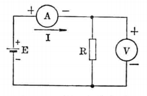

# 定律

[TOC]

## 欧姆定律

通过电路中的电流与电路两端电压成正比，与电路中的电阻成反比。
$$
\Huge I = \frac{U}{R}
$$
* I				电流（A）
* U              电压（V）
* R               电阻（Ω）

### 测量电路

 

## 基尔霍夫定律

**第一定律（基尔霍夫电流定律，电流保守原理）：**在任何一个直流电路中，流入任何一点的电流应该等于从这一点流出的电流。(流进某点的电流之和等于流出该点的电流之和；常称该点为节点)

**第二定律（基尔霍夫电压定律，电压保守原理）：**在任何一个闭合回路中，各元件上的电压降的代数和等于电动势的代数和，即从一点出发绕回路一周回到该点时，各段电压的代数和恒等于零。