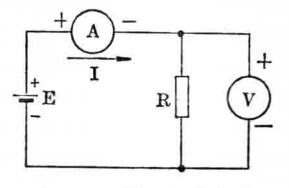

# 定律

[TOC]

## 欧姆定律

通过电路中的电流与电路两端电压成正比，与电路中的电阻成反比。

$$
\Huge I = \frac{U}{R}
$$

- I — 电流 (A)
- U — 电压 (V)
- R — 电阻 (Ω)

### 适用条件

欧姆定律适用于**线性电阻**（伏安特性为过原点的直线）。对于非线性元件（二极管、三极管、灯泡灯丝等），该定律形式上仍可使用，但 R 不再是常数。

### 测量电路

---

## 焦耳定律

电流通过导体时产生的热量，与电流的平方、导体的电阻和通电时间成正比，这是电流的**热效应**。

$$
\Huge Q = I^{2}Rt
$$

- Q — 产生的热量 (J)
- I — 电流 (A)
- R — 电阻 (Ω)
- t — 时间 (s)

**应用**：电热器（电炉、电烙铁）、熔断器（保险丝）  
**危害**：导线过热 → 绝缘老化 → 火灾隐患。因此导线需根据载流量选择。

---

## 基尔霍夫定律

### 第一定律（KCL，电流定律）

在任何一个电路中，流入任一点的电流之和必等于流出该点的电流之和（电荷守恒）。

$$
\Huge \sum I_{\text{进}} = \sum I_{\text{出}}
$$

### 第二定律（KVL，电压定律）

在任何一个闭合回路中，各元件上电压降的代数和等于电动势的代数和。即从一点出发绕回路一周回到该点时，各段电压的代数和恒等于零。

$$
\Huge \sum U = 0
$$

---

## 戴维南定理（等效发电机原理）

对于任何一个由电源和电阻组成的、有两个引出端的复杂电路，总可以化简为一个由**等效电压源 E₀**和**等效电阻 R₀**相串联的简单回路来代替。

- E₀ = 两引出端断开时的**开路电压**
- R₀ = 将原电路中所有独立电压源短路、独立电流源开路后，两引出端间的总电阻

> 应用场景：分析负载变化时各电气量的变化时，用戴维南等效可大幅降低计算量。

---

## 诺顿定理

与戴维南定理对偶，将任意二端网络等效为**等效电流源 I₀**与**等效电阻 R₀ 并联**的简单电路。

- I₀ = 两引出端短接时的**短路电流**
- R₀ 求法同戴维南

| | 戴维南等效 | 诺顿等效 |
|---|:---:|:---:|
| 电源形式 | 电压源串联 | 电流源并联 |
| 关键参数 | 开路电压 E₀ | 短路电流 I₀ |
| 互转关系 | E₀ = I₀ · R₀ | I₀ = E₀ / R₀ |

---

## 叠加定理

在线性电路中，多个独立电源共同作用时，任意支路的电流（或电压）等于各个独立电源**单独作用**时在该支路产生的电流（或电压）的**代数和**。

> 使用时要将不作用的电压源短路、电流源开路。

**注意**：叠加定理仅适用于线性电路，不能用于功率计算（因功率与电流/电压是平方关系）。

---

## 最大功率传输定理

当负载电阻 R(L) 等于电源内阻 R(s) 时，负载将获得**最大功率**。

$$
\Huge R_L = R_s \Rightarrow P_{max} = \frac{E^{2}}{4R_s}
$$

> 适用场景：信号链（前级输出阻抗 = 后级输入阻抗）、RF 天线匹配、音频功放输出匹配。

注意：此时传输效率仅 50%，另外一半消耗在内阻上。因此在电力系统中追求**高效率**而非最大功率（负载阻抗 >> 内阻）。

---

## 楞次定律

感应电流的方向，总是使它所产生的磁通量**阻碍**引起该感应电动势的原磁通量的变化。

> "增则反，减则同"——原磁通增加时，感应磁通与之反向；原磁通减少时，感应磁通与之同向。

楞次定律实质上是**能量守恒定律**在电磁感应现象中的体现。

---

## 法拉第电磁感应定律

闭合回路中感应电动势的大小，等于穿过该回路的磁通量对时间的变化率的负值。

$$
\Huge \varepsilon = -N \frac{d\Phi}{dt}
$$

- ε — 感应电动势 (V)
- N — 线圈匝数
- Φ — 磁通量 (Wb)
- dΦ/dt — 磁通变化率 (Wb/s)

负号即楞次定律的数学表达。

---

## 安培定则（右手螺旋定则）

- **直线电流**：右手握导线，拇指指向电流方向，四指弯曲方向为磁感线方向。
- **螺线管电流**：右手握线圈，四指指向电流方向，拇指指向 N 极。

---

## 左手定则（电动机定则）

伸开左手，使拇指与其余四指垂直且在同一平面内。让磁感线**穿入手心**，四指指向电流方向，则拇指所指即为通电导体**受力方向**（安培力方向）。

> 应用：直流电动机原理。

---

## 右手定则（发电机定则）

伸开右手，使拇指与其余四指垂直。让磁感线**穿入手心**，拇指指向导体运动方向，则四指所指即为**感应电流方向**。

> 应用：交流发电机原理。

---

## 库仑定律

真空中两个点电荷之间的作用力，与电荷量的乘积成正比，与距离的平方成反比。

$$
\Huge F = k \frac{q_1 q_2}{r^{2}}
$$

- F — 静电力 (N)
- k — 静电力常量  ≈ 9 × 10⁹ N·m²/C²
- q₁、q₂ — 点电荷电量 (C)
- r — 距离 (m)

同号相斥、异号相吸。
