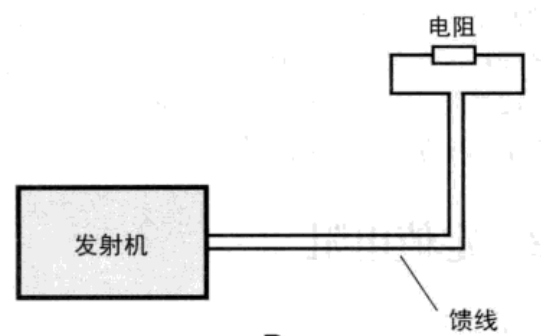

# 电功率

[TOC]

## 电功

电流所做的功。电流通过负载时，将电能转换为其他形式的能量（热能、光能、机械能等）。

$$
\Huge W = IUt
$$

- W — 电功 (J — 焦耳)
- I — 电流 (A)
- U — 电压 (V)
- t — 时间 (s)

**物理意义**：移动 1 C 电荷通过 1 V 的电位差所做的功就是 1 J。

### 常用单位

| 单位 | 符号 | 与焦耳的换算 |
|------|------|:----------:|
| 焦耳 | J | 1 |
| 瓦特·秒 | W·s | = 1 J |
| 千瓦·时（度） | kW·h | 1 kW·h = 3.6 × 10⁶ J |
| 电子伏特 | eV | 1 eV = 1.602 × 10⁻¹⁹ J |

> 电能表（电度表/千瓦时表）计量家庭用电，1 度电 = 1 千瓦·时。

---

## 电功率

单位时间内电流所做的功，即电能转换的速率。

**符号**：P
**单位**：瓦特，瓦 (W)

### 直流功率

$$
\Huge P = UI
\quad
\Huge P = I^{2}R
\quad
\Huge P = \frac{U^{2}}{R}
$$

**特殊单位**：马力 (HP, Horse Power)

- 1 HP（英制）= 746 W
- 1 HP（公制）= 735.5 W ≈ 735 W

### 常见电器功率参考

| 电器 | 典型功率 |
|------|:------:|
| LED 灯泡 | 3 ~ 15 W |
| 节能灯 | 8 ~ 20 W |
| 白炽灯 | 25 ~ 100 W |
| 笔记本 | 30 ~ 90 W |
| 台式电脑（含显示器） | 150 ~ 400 W |
| 液晶电视 (55寸) | 100 ~ 150 W |
| 冰箱 | 100 ~ 300 W |
| 微波炉 | 800 ~ 1500 W |
| 电热水壶 | 1500 ~ 2200 W |
| 空调 (1.5匹) | 1000 ~ 1500 W (运行时) |
| 电磁炉 | 1800 ~ 2200 W |
| 电吹风 | 800 ~ 2000 W |

---

## 交流电路中的功率

在交流电路中，由于电压与电流存在相位差，功率分为三种：

### 有功功率 (Active Power, P)

实际消耗并转换为有用功的功率，单位：瓦 (W)

$$
\Huge P = UI\cos\varphi
$$

- cos φ — **功率因数** (Power Factor)

### 无功功率 (Reactive Power, Q)

在电感和电容中储存并在每个周期内与电源交换的功率，不做有用功。单位：乏 (var)

$$
\Huge Q = UI\sin\varphi
$$

感性负载（电机、变压器）消耗无功功率以建立磁场。容性负载（长距离输电线、电容器组）提供无功功率。电力系统中需进行**无功补偿**（并接电容器组）以提高功率因数。

### 视在功率 (Apparent Power, S)

电压与电流有效值的直接乘积，反映电源需提供的总容量。单位：伏安 (VA)

$$
\Huge S = UI
\quad
\Huge S = \sqrt{P^{2} + Q^{2}}
$$

### 功率三角形



三者关系构成直角三角形（功率三角形）：

```
     /|
 S  / | Q
  /  |
 /___|
   P
S² = P² + Q²
```

---

## 功率因数 (Power Factor)

$$
\Huge PF = \cos\varphi = \frac{P}{S}
$$

| 负载类型 | cos φ | 说明 |
|----------|:---:|------|
| 纯电阻负载 | 1.0 | 电热器、白炽灯 |
| 感性负载（电机） | 0.5 ~ 0.9 | 空载低、满载高 |
| 容性负载 | 超前 | 纯电容 = 0（导前） |

### 功率因数低的影响

1. 视在功率大 → 发电/输电设备容量利用率低
2. 线路电流大 → 导线损耗 (I²R) 增加
3. 线路压降增大 → 末端电压降低

### 提高功率因数的方法

1. **并联电容器**（最常用）：补偿感性无功
2. **同步补偿机**：大型工业
3. **选用高效电机**：减少空载运行
4. **合理选配电机容量**：避免"大马拉小车"

> 中国电力系统对工业用户有功率因数考核，cos φ < 0.9 时需缴纳力率调整电费。

---

## 电能质量

### 电压波动与闪变

大功率负荷（电弧炉、电焊机）的启停引起电压快速变化。

### 谐波

非线性负载（变频器、开关电源、LED 驱动器）产生谐波电流，导致：
- 变压器过热
- 中性线过流
- 电容器烧毁
- 继电保护误动作

> GB/T 14549 对公用电网谐波电压和谐波电流有明确限值要求。

---

## 安全与节能

### 导线载流量与功率匹配

常用铜芯导线载流量 (PVC绝缘, 环境30°C) 参考：

| 导线截面 (mm²) | 载流量 (A) | 单相 220V 可带功率 |
|:---:|:---:|:---:|
| 1.5 | 14 ~ 18 | ~3 kW |
| 2.5 | 22 ~ 26 | ~5 kW |
| 4 | 30 ~ 35 | ~7 kW |
| 6 | 38 ~ 42 | ~9 kW |
| 10 | 55 ~ 60 | ~12 kW |

> 实际敷设条件（穿管、环境温度）需降额使用。
