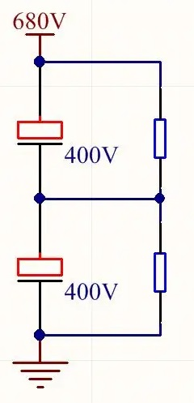

# 电容

[TOC]

## 概述

电容器是储存电荷的容器，简称电容。

两个（或两组）彼此绝缘而又相互靠近的导体组合。导体形成电容的两个电极。

电容量与两极的正对面积和插入两极间的电介质的介电常数成正比，而与两极间的距离成反比。

**符号：**C

**参数：**电容值，耐压值

**单位：**F  μF  pF  法拉  法

## 用途

* 隔直流、通交流

* 阻交流

  电容对交流电的阻碍能力为容抗（X~C~），单位为 Ω 。f 为交流电的频率，基本单位为 Hz ; C 为电容的电容量，单位是 F  。
$$
\Huge X_{C}=\frac{1}{2 \pi f C }
$$

## 分类

**类型：**      固定电容，可变电容，半可变（微调）电容

**电介质：**  涤纶电容，云母电容，瓷介电容，电解电容，纸介电容，玻璃釉电容，金属膜电容，有机薄膜电容，空气电容

**极性:**         极性电容，无极性电容

**电解电容:** 铝电解电容，钽电解电容

## 串/并联

### 串联

电容器串联后相当于电容器的极板间距离增大。

总电容的倒数，等于各个电容的电容量倒数之和。
$$
\Huge \frac{1}{C} =  \frac{1}{C_{1}} + \frac{1}{C_{2}}
$$
串联后，可以解决电容器耐压值不够的问题。但因每个电容的绝缘电阻不同，需计算各个电容两端电压，避免超过耐压值。可在每个电容上并联均压电阻。

 

不同电容量的电容串联时，电容量小的电容器承受的电压较高。

### 并联

电容器并联后相当于极板面积增大。

总电容等于各个电容的电容量之和。
$$
\Huge C = C_{1} + C_{2} 
$$
并联后电容的耐压值与耐压值较小的一样。

## 电容参数

| 种类     | 容量范围          | 误差        | 漏电流 | 应用     |
| -------- | ----------------- | ----------- | ------ | -------- |
| 涤纶电容 | 100pF -  22uF     | ±20%        | 小     | 一般用途 |
| 云母电容 | 1pF     -  47nF   | ±1%         | 小     | 高频     |
| 瓷介电容 | 0.1pF  -  10uF    | -25% - +50% | 小     | 退耦     |
| 铝电解   | 0.1uF  -  4F      | -10% - +50% | 大     | 低频     |
| 钽点解   | 0.47    -  470 uF | ±20%        | 小     | 低压     |

## 电介质常数
| 物质                 | 电介质常数（近似） |
|----------------------|--------------------|
| 在海平面处的干燥空气 | 1.0                |
| 玻璃                 | 4.8-8.0            |
| 云母                 | 4.0-6.0            |
| 聚酯薄膜             | 2.9-3.1            |
| 纸张                 | 3.0-3.5            |
| 坚硬透明的塑料       | 3.0-4.0            |
| 聚乙烯               | 2.2-2.3            |
| 聚苯乙烯             | 2.4-2.8            |
| 聚氯乙烯             | 3.1-3.3            |
| 陶瓷                 | 5.3-6.0            |
| 石英                 | 3.6-4.0            |
| 钛酸锶               | 300-320            |
| 特弗龙               | 2.2-2.2            |
| 氧化钛               | 160-180            |
| 真空                 | 1.0                |

## 单连可变电容
360pF,290pF,270pF

最小值9pF

## 铝电解电容器的套管颜色与其代表的特性 	

| 系列  | 特点          |通用性|小型化 |薄型化|低阻抗|双极性|低漏电| 用途               | 电压范围   | 容量范围       | 套管颜色 |
|------|---------------|---- |-----|-----|-----|-----|-----|--------------------|----------|---------------|---------|
| MG   | 小型标准品      |	*   |	*   |     |     |     |     | 一般电路            | 6.3～250V | 0.22～10000μF |	黑      |
| MT   | 105℃小型标准品 | *   | *   |     |     |     |     | 高温一般电路         | 6.3～100V | 0.22～1000μF 	| 橙      |
| SM   | 高度为7mm 	   | *   | *   | *   |　   |      |     | 微型机 	           | 6.3～63V  |	0.1～190μF 	 | 蓝       |
| MG-9 | 高度为9mm      | *   | * 	 | *   |     |　 	 |     | 薄型机 	           | 6.3～50V  |	0.1～470μF 	 | 黑       |
| BP   | 双极性品	      |	    | * 	|      |     | *	 |	   | 极性反转回路 	     | 6.3～50V  |	0.47～470μF   | 浅蓝     |
| EU   | 高稳定品       |     |     |      | * 	 | 	   |     | 定时电路，代替钽电容 |	16～50V    |	0.1～470μF    | 浅紫     |
| LL   | 低漏电电流      |    | *   |	   	| 	  |     | *   |	定时电路，小信号电路  |	10～50V   | 0.1～1000μF   |	黄       |
| BPC  | 耐高纹波电流 	 |     |* 　 |      | *   | *   |    |	电视机S校正          |	25～50V   | 1～12μF       |	深蓝     |
| BPA  | 音质改善用 	    |     |*   |*     | * 	| * 	|    	| 音频电路            |	25～63V   | 1～10μF       |	海蓝     |
| HF   | 低阻抗	       |     |*    |      |	*   |　   |	   | 开关电路            |	6.3～63V | 22～2200μF    |	灰     |
| HV   | 高耐压         | 	   | 	　 |      | 	　 |	　 	|     | 高压电路           |	160～400V | 1～100μF      |	西太青蓝 |

## 种类

* PPN电容
* PET电容
* MEA电容
* MPB电容
* PPT 电容
* MPT电容
* 电解电容器
* MET电容
* MKPH电容
* 电机用电容
* MKS电容
* 瓷片电容图3、4是MKP电容；图5是贴片电解电容；图6是史普瑞电容Sprague Orange Drop Capacitors；图7是电机用电容；图8是MKT电容；图9是陶瓷。图1是MKS电容；图3、8是云母电容；图4是MPP电容；图5是MKP电容；图9是MEP电容；图10是MPP电容；图11是PPN电容；图12是PEI电容。图1、2、3是陶瓷电容器；图4是色环陶瓷电容；图5、10、11是电机起动及运行电容器；图12是充放电用电容。图1是双连调谐电容；图2是微调电容；图3是四连调谐电容；图4是单连调谐电容。

## 电容各单位间转换表

## 电容充放电

电容器充放电时间的快慢仅与电阻值 R 及电容值 C 的乘积 RC 有关，而与电源电动势 E 大小无关。
$$
\Huge\tau = RC
$$

* τ	阻容回路的充放电时间常数    s
* R                                                     Ω
* C                                                     F