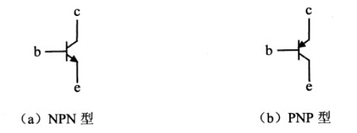
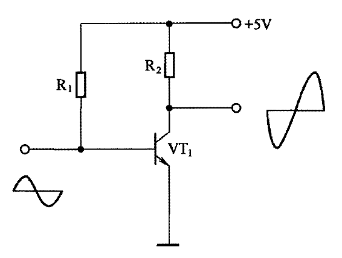
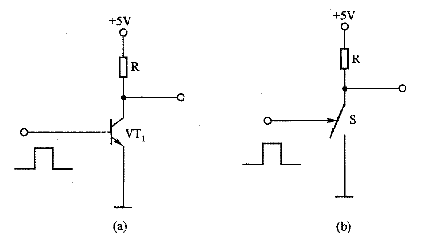

# 三极管

[TOC]

## 概述

**三极管**（Transistor，又称双极型晶体管 BJT）是半导体基本元器件之一，具有**电流放大**作用，是电子电路的核心元件。

三极管是在一块半导体基片上制作两个相距很近的 PN 结，将整块半导体分成三部分：中间是**基区**，两侧分别是**发射区**和**集电区**。根据半导体排列方式，分为 **PNP** 和 **NPN** 两种类型。

> 晶体三极管是 1947 年贝尔实验室的巴丁、布拉顿和肖克利发明的，三人因此获得 1956 年诺贝尔物理学奖。

---

## 管脚

| 管脚 | 名称 | 英文名 | 功能 |
|:---:|------|--------|------|
| B / b | 基极 | Base | 控制端，小电流控制大电流 |
| C / c | 集电极 | Collector | 收集多数载流子 |
| E / e | 发射极 | Emitter | 发射多数载流子 |

---

## 结构与 PN 结

| 结 | 位置 | 正常偏置（放大态） |
|------|------|:---:|
| **发射结** (B−E) | 基区与发射区之间 | 正向偏置 |
| **集电结** (B−C) | 基区与集电区之间 | 反向偏置 |

> 关键特性：三极管工作在放大区时，发射结正偏、集电结反偏。基区做得**极薄**（μm 级），掺杂浓度很低，使发射极注入基区的多数载流子绝大部分被集电极收集。

---

## NPN 与 PNP 的区别

| | NPN | PNP |
|---|---|---|
| 符号箭头 | 发射极箭头**向外** | 发射极箭头**向内** |
| 电流方向 (Ic) | C ← E（集电极流入） | E → C（集电极流出） |
| 导通条件 | V(B) > V(E) + 0.7 V (硅) | V(B) < V(E) − 0.7 V (硅) |
| 开关应用 | 低端驱动 (负载在 C 与 VCC 间) | 高端驱动 (负载在 E 与 GND 间) |
| 常见性 | **更常用**（电子为载流子、迁移率高、速度快） | |

### 硅管与锗管

| | 硅管 (Si) | 锗管 (Ge) |
|---|---|---|
| V(BE) (导通) | ~0.6 ~ 0.7 V | ~0.2 ~ 0.3 V |
| 温度稳定性 | 好 (I(CBO) 小) | 差 |
| 耐压 | 高 | 低 |
| 主流 | **几乎全部** | 早期/特殊用途 |

---

## 电流放大作用

三极管的核心作用是将基极电流 I(B) 放大为集电极电流 I(C)：

$$
\Huge I_C = \beta \cdot I_B
$$
$$
\Huge I_E = I_C + I_B = (\beta + 1) I_B
$$

- β (h(FE)) — 直流电流放大系数，通常 50 ~ 400
- I(E) — 发射极电流
- I(B) 为 μA 级 → I(C) 可达 mA 级

---

## 三种工作状态

| 状态 | 发射结偏置 | 集电结偏置 | I(C) | 应用 |
|------|:---:|:---:|------|------|
| **截止** | 反偏 (或零偏) | 反偏 | ≈ 0 | 开关断开 |
| **放大** | 正偏 | 反偏 | I(C) = β · I(B) | 模拟放大电路 |
| **饱和** | 正偏 | 正偏 | I(C) < β · I(B)，接近 VCC/R(C) | 开关导通 |

### 模拟电路中——放大状态

三极管主要工作在**放大区**。通过适当设置直流偏置，使静态工作点 Q 位于放大区中央，实现对交流小信号的线性放大。

### 数字电路中——开关状态

三极管主要工作在**截止**与**饱和**状态之间切换，作为电子开关。

---

## 分类

### 按频率分

| 类型 | 特征频率 f(T) | 典型应用 |
|------|:---:|------|
| 低频管 | < 3 MHz | 音频放大 |
| 高频管 | > 30 MHz | RF、中频放大 |

### 按功率分

| 类型 | P(C) (最大集电极损耗) | 封装 |
|------|:---:|------|
| 小功率管 | < 1 W | TO-92、SOT-23 |
| 中功率管 | 1 ~ 10 W | TO-126、TO-220 |
| 大功率管 | > 10 W | TO-3、TO-247（带散热器） |

### 按结构分

- PNP
- NPN

### 按材质分

- 硅管（主流）
- 锗管（少见）

### 按功能分

- 放大管（高 β、低噪声）
- 开关管（低 V(CE(sat))、快开关速度）

---

## 晶体管类型扩展

除双极型晶体管 (BJT) 外，还有：

| 类型 | 全称 | 控制方式 | 特点 |
|------|------|:---:|------|
| BJT | Bipolar Junction Transistor | 电流控制 (I(B)) | 双极性，最经典 |
| JFET | Junction Field Effect Transistor | 电压控制 (V(GS)) | 高输入阻抗 |
| MOSFET (耗尽型) | Metal-Oxide-Semiconductor FET | 电压控制 | 耗尽型常导通 |
| MOSFET (增强型) | 同上 | 电压控制 | **增强型最常用**——数字电路主力 |
| IGBT | Insulated Gate Bipolar Transistor | 电压控制 | 兼具 MOSFET 输入 + BJT 输出，大功率 |
| UJT | Unijunction Transistor | — | 负阻特性，触发电路用 |

---

## 命名方式

### 日本半导体器件命名法 (JIS C 7012)

| 型号前缀 | 含义 |
|:---:|------|
| 2SA | PNP 高频管 |
| 2SB | PNP 低频管 |
| 2SC | NPN 高频管 |
| 2SD | NPN 低频管 |

> 韩国 (如 KSC、KSD) 沿用了类似命名规则。例：2SC1815 (NPN 高频小信号管)、2SA1015 (PNP 对管)。

---

## 关键额定值

### 耐压

| 参数 | 含义 |
|------|------|
| V(CBO) | 发射极**开路**时，集电极-基极间最大反向电压 |
| V(CEO) | 基极**开路**时，集电极-发射极间最大电压（最常用极限参数） |
| V(EBO) | 集电极开路时，发射极-基极最大反向电压（通常仅 5 ~ 7 V） |

> V(CEO) < V(CBO)，使用时必须降额（一般留 50% 以上裕量）。

### 电流

| 参数 | 含义 |
|------|------|
| I(C)max | 集电极最大允许直流电流 |
| I(B)max | 基极最大允许电流 |

### 功率

| 参数 | 含义 |
|------|------|
| P(c)max | 集电极最大耗散功率。与环境温度和散热条件密切相关 |

---

## h(FE) 分档

同一型号三极管的 β 值离散性很大（可能在 100 ~ 800 之间），厂家按不同 β 范围分档标记：

| 档位 | 颜色 / 标识 | β 范围 (典型) |
|:---:|------|:---:|
| O | 橙色 | ~40 ~ 80 |
| Y | 黄色 | ~70 ~ 140 |
| GR | 绿色 | ~100 ~ 200 |
| BL | 蓝色 | ~200 ~ 400 |

> 例：2SC1815-GR 表示该管的 h(FE) 约在 100 ~ 200 范围内。

---

## 万用表检测三极管

### 判别基极和类型（指针表 R×100 或 R×1K 档）

1. 黑表笔固定某个电极，红表笔分别测另两脚
2. 若两次阻值**都小** → 黑笔接的是基极，**NPN 型**
3. 若两次阻值**都大** → 黑笔接的是基极，**PNP 型**（交换笔色重复）
4. 若一大一小 → 换脚重新固定

### 判别集电极与发射极

确定基极后，对于 **NPN** 管：

1. 两表笔接另外两只脚，交替测量两次
2. 阻值**较小**的那一次 → 黑笔接**集电极**，红笔接**发射极**（PNP 则相反）

> 数字万用表通常带有 **h(FE) 测试插孔**，直接插入对应 BCE 孔即可读取 β 值。

### 好坏判断

- **BE 结 / BC 结**应呈现单向导电性（PN 结特征）
- CE 之间应高阻（指针表 R×10K 档测应量不出短路）
- 若任意两极之间短路或开路 → 已损坏的管子

---

## 常用型号速查

| 型号 | 类型 | V(CEO) | I(C)max | 典型用途 |
|------|------|:---:|:---:|------|
| 2N2222 | NPN | 40 V | 600 mA | 通用开关/放大 |
| 2N3904 | NPN | 40 V | 200 mA | 小信号通用 |
| 2N3906 | PNP | −40 V | −200 mA | PNP 对管 |
| BC547 | NPN | 45 V | 100 mA | 欧洲通用小信号 |
| BC557 | PNP | −45 V | 100 mA | BC547 的 PNP 对管 |
| 2SC1815 | NPN | 50 V | 150 mA | 日本通用小信号 |
| 2SA1015 | PNP | −50 V | −150 mA | 2SC1815 的 PNP 对管 |
| S8050 | NPN | 25 V | 500 mA | 中功率驱动 |
| S8550 | PNP | −25 V | −500 mA | S8050 的 PNP 对管 |
| 2N3055 | NPN | 60 V | 15 A | 经典大功率管 |
| TIP120 | NPN 达林顿 | 60 V | 5 A | 高增益大电流开关 |
| MJE13003 | NPN | 400 V | 1.5 A | 节能灯/开关电源 |
