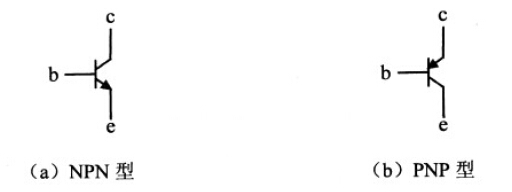

# 三极管
双极型晶体管
双极型晶体管(Bipolar Juction Transistor,BJT)
结型场效应管(Field Effect Transistor,FET)
金属氧化半导体场效应管（MOSFET）耗尽型
金属氧化半导体场效应管（MOSFET）增强型
单结晶体管
## 管脚
| 管脚 | 名称   | 英文名    |
|------|--------|-----------|
| b    | 基极   | base      |
| c    | 集电极 | collector |
| e    | 发射极 | emitter   |

## 发射结与集电结
发射结---发射区与基区边界形成的PN结，
集电结---集电区与基区边界形成的PN结。

## 分类
NPN 型和 PNP 型
 

## 用途
放大器，开关

## 命名方式
### 日本

| 型号 | 描述    |
|------|---------|
| 2SA  | PNP高频 |
| 2SB  | PNP低频 |
| 2SC  | NPN高频 |
| 2SD  | NPN低频 |

## 额定值
### 耐压
集电极-基极间电压VCBO---在发射极开路状态下，加在集电极-基极间的最大电压。  
集电极-发射极间电压VCEO---在基极开路状态下，加在集电极-发射极间的最大电压。

## hFE分档
O Y GR BL

晶体三极管是半导体基本元器件之一，具有电流放大作用，是电子电路的核心元件。三极管是在一块半导体基片上制作两个相距很近的PN结，两个PN结把整块半导体分成三部分，中间部分是基区，两侧部分是发射区和集电区，排列方式有PNP和NPN两种。

**一、三极管的电路符号**

**二、三极管的分类**

a、按频率分：高频管和低频管
 b、按功率分：小功率管，中功率管和大功率管
 c、按机构分：PNP管和NPN管
 d、按材质分：硅管和锗管
 e、按功能分：开关管和放大管

**三、用万用表判断半导体三极管的极性和类型（用指针式万用表）**

a、先选量程：R﹡100或R﹡1K档位。

b、判别半导体三极管基极：
 用万用表黑表笔固定三极管的某一个电极，红表笔分别接半导体三极管另外两各电极，观察指针偏转，若两次的测量阻值都大或是都小，则改脚所接就是基极（两次阻值都小的为NPN型管，两次阻值都大的为PNP型管），若两次测量阻值一大一小，则用黑笔重新固定半导体三极管一个引脚极继续测量，直到找到基极。

c、判别半导体三极管的c极和e极：
 确定基极后，对于NPN管，用万用表两表笔接三极管另外两极，交替测量两次，若两次测量的结果不相等，则其中测得阻值较小得一次黑笔接的是e极，红笔接得是c极（若是PNP型管则黑红表笔所接得电极相反）。

d、判别半导体三极管的类型。
 如果已知某个半导体三极管的基极，可以用红表笔接基极，黑表笔分别测量其另外两个电极引脚，如果测得的电阻值很大，则该三极管是NPN型半导体三极管，如果 测量的电阻值都很小，则该三极管是PNP型半导体三极管。

**四、半导体三极管的好坏检测**

a、先选量程：R﹡100或R﹡1K档位

b、测量PNP型半导体三极管的发射极和集电极的正向电阻值。
 红表笔接基极，黑表笔接发射极，所测得阻值为发射极正向电阻值，若将黑表笔接集电极（红表笔不动），所测得阻值便是集电极的正向电阻值，正向电阻值愈小愈好。

c、测量PNP型半导体三极管的发射极和集电极的反向电阻值。
 将黑表笔接基极，红表笔分别接发射极与集电极，所测得阻值分别为发射极和集电极的反向电阻，反向电阻愈小愈好。

d、测量NPN型半导体三极管的发射极和集电极的正向电阻值的方法和测量PNP型半导体三极管的方法相反。
