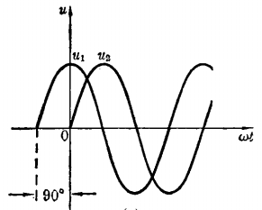
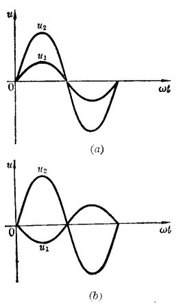
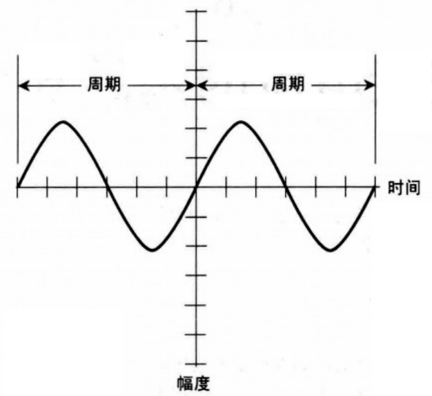
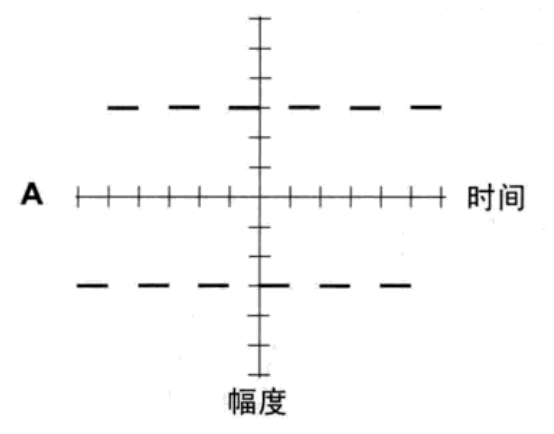
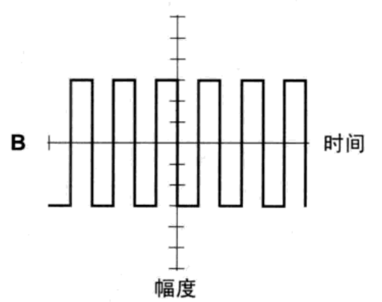
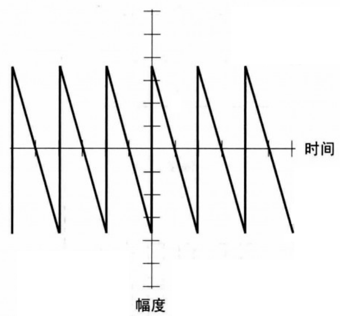
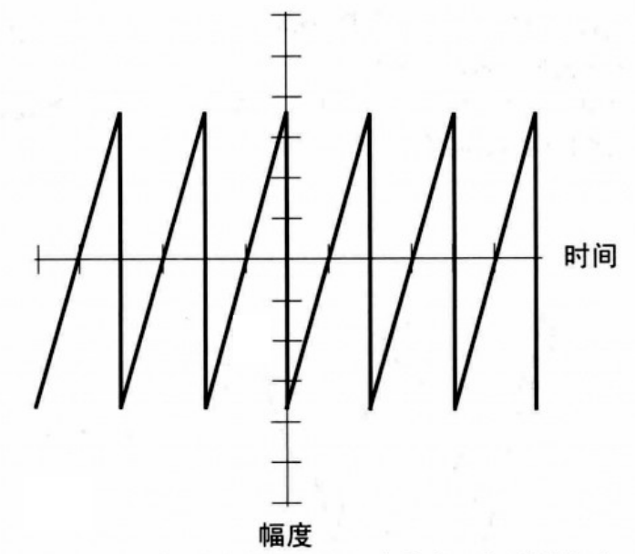
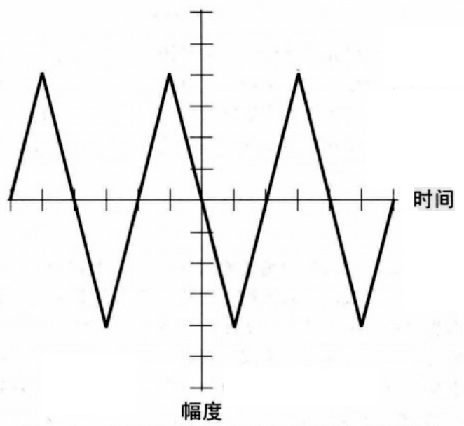
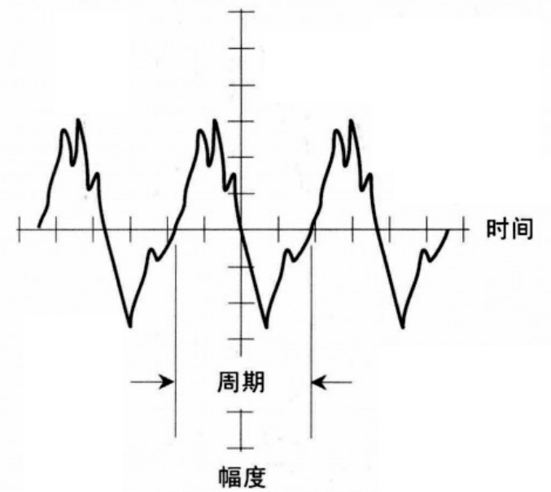

# 交流电

[TOC]

## 概述

**交流电** (Alternating Current, AC) 是指大小和方向随时间周期性变化的电流/电压。现代电力系统普遍采用正弦交流电（50 Hz 或 60 Hz），其原因是可以方便地通过变压器升降电压，实现高效远距离输电。

### 交流电的优越性（相比直流输电）

| 特点 | 说明 |
|------|------|
| 可变压 | 通过变压器随意升/降压 |
| 发电机结构简单 | 交流同步发电机无换向器 |
| 高压输电损耗小 | 升压后电流小 → I²R 损耗低 |
| 开关灭弧容易 | 交流电自然过零点 → 电弧容易熄灭 |

> 直流输电 (HVDC) 近年来在超远距离、跨海电缆等场景发展迅速，但末端仍需逆变为交流给用户使用。

---

## 正弦波参数

### 频率与周期

$$
\Huge f = \frac{1}{T}
$$

| 地区 | 电网频率 | 周期 |
|------|:---:|:---:|
| 中国/欧洲/大多数国家 | 50 Hz | 20 ms |
| 北美/日本(西部)/台湾 | 60 Hz | 16.67 ms |
| 航空 | 400 Hz | 2.5 ms |

> 航空选用 400 Hz 是为减轻变压器重量（频率越高，铁芯截面越小）。

### 瞬时值、最大值、有效值

**瞬时值 (Instantaneous Value)**：在任一瞬时的交流电值，用小写字母表示，如 u、i。

**最大值 (Peak Value)**：瞬时值中的最大绝对值，用 U(m)、I(m) 表示。也称幅值或峰值。

**有效值 (RMS, Root Mean Square)**：将交流电在一个电阻上产生的热效应，与某个直流电在同一电阻上产生的热效应相等时，该直流电的数值即为交流电的**有效值**。

> 日常所说的"220 V 市电"即有效值，一般交流电压表/电流表读数也是有效值。

正弦波有效值与最大值的关系：

$$
\Huge U = \frac{1}{\sqrt{2}} U_{m} = 0.707 \, U_{m} \\
\Huge I = \frac{1}{\sqrt{2}} I_{m} = 0.707 \, I_{m}
$$

$$U_{m} = \sqrt{2} U \approx 1.414 \, U$$

> 220 V 市电的峰值 U(m) = 220 × 1.414 ≈ 311 V，峰-峰值 U(p-p) ≈ 622 V！

### 平均值 (Average Value)

对称正弦波正半周的平均值：U(avg) = 0.637 U(m)

---

## 相位

### 角频率

交流电在 1 秒内变化的相位角（电角度）：

$$
\Huge \omega = 2\pi f
$$

- ω — 角频率 (rad/s)
- f — 频率 (Hz)

对于 50 Hz 交流电：ω = 2π × 50 = 314 rad/s

### 相位差

两个同频率正弦波的初相之差。

- 当一正弦波比另一正弦波先到达最大值 → **超前**
- 反之称为**滞后**

上图中 u₁ (0° 初相) 与 u₂ (90° 初相) 的相位差 φ = 90°− 0° = 90°，u₁ 超前 u₂ 90°。

### 特殊相位关系

| 相位差 | 关系 | 波形 |
|:---:|------|------|
| 0° | 同相 | 同步到达峰值 |
| 90° | 正交 | 电感:电流滞后电压 90°；电容:电流超前电压 90° |
| 180° | 反相 | 同时过零，但方向始终相反 |

---

## 正弦波数学表达式

$$
\Huge i = I_{m} \sin(\omega t + \varphi)
$$

- i — 电流瞬时值
- I(m) — 电流最大值
- ω — 角频率
- φ — 初相位 (t = 0 时的相位)
- (ω t + φ) — t 时刻的相位角

### 复数表示法（相量）

正弦交流电可用**相量 (Phasor)**表示，将同频率正弦量的运算转化为复数运算：

$$
\Huge \dot{U} = U \angle \varphi_{u}
\quad
\Huge \dot{I} = I \angle \varphi_{i}
$$

其中 U、I 为有效值，∠ 后在角度为相位。

---

## 三相交流电

三相交流电由频率相同、幅值相等、相位互差 120° 的三组正弦电压组成：

$$
u_a = U_m \sin(\omega t)
$$
$$
u_b = U_m \sin(\omega t - 120^\circ)
$$
$$
u_c = U_m \sin(\omega t + 120^\circ)
$$

### 三相接法

| 接法 | 相电压 | 线电压 | 线电流 | 应用 |
|------|:---:|:---:|:---:|------|
| **星形 (Y)** | U(φ) | U(L) = √3 · U(φ) | I(L) = I(φ) | 配电、电机 |
| **三角形 (Δ)** | U(φ) = U(L) | — | I(L) = √3 · I(φ) | 大功率电机 |

> 中国低压三相四线制：相电压 220 V，线电压 ≈ 380 V (= 220 × √3)。

---

## 常见波形

### 正弦波
最基本的周期波形，仅含单一频率（基波），无谐波成分。

### 方波
高电平和低电平交替出现：

$$
V(t) = \frac{4V_p}{\pi} \left(\sin\omega t + \frac{1}{3}\sin 3\omega t + \frac{1}{5}\sin 5\omega t + \cdots\right)
$$

仅含奇次谐波（幅度 1/n 递减）。

### 锯齿波
线性上升后突降（或反之），含丰富的奇偶次谐波。

### 复杂波形
由多种不同频率、幅值、相位的正弦波叠加而成。

---

## 交流电路中的阻抗

在交流电路中，电阻、电感、电容对电流的阻碍作用统称为**阻抗 (Impedance, Z)**：

$$
\Huge Z = R + jX
$$

| 元件 | 阻抗 | 相位 |
|------|------|:---:|
| 纯电阻 R | Z = R | 电压电流同相 |
| 纯电感 L | Z = jωL | 电流滞后电压 90° |
| 纯电容 C | Z = −j/(ωC) | 电流超前电压 90° |

---

## 交流电的功率

参见 [电功率](6_电功率.md)——交流电路中分为有功功率 P、无功功率 Q、视在功率 S 三种。

---

## 整流：AC → DC

将交流电转换为直流电的过程：

| 整流方式 | 二极管数 | 纹波 | 效率 |
|----------|:---:|:---:|:---:|
| 半波整流 | 1 | 大 | 低 |
| 全波整流（中心抽头） | 2 | 中 | 中 |
| 桥式全波整流 | 4 | 中 | 高（最常用） |

整流后需经滤波电容平滑，再经稳压电路获得纯净直流。

---

## 交流电安全

| 电压等级 | 安全距离（无防护） |
|------|:---:|
| 220 V | 不直接接触带电部分 |
| 10 kV | ≥ 0.7 m |
| 35 kV | ≥ 1.0 m |
| 110 kV | ≥ 1.5 m |
| 220 kV | ≥ 3.0 m |

> 人体感知电流：~1 mA；摆脱电流：~10 mA（男性）；致命电流：≥ 50 mA（通过心脏时）。交流 50 Hz 对人体的危害大于同电压直流，因 50 Hz 接近心脏易颤频率。
