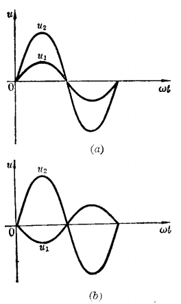

# 交流电

[TOC]

## 概述

## 值(正弦波)

### 有效值

把某一交流电流（或电压）在一个电阻上所能产生的热效应，假如和另外一直流电流（或电压）在同一电阻上所产生的热效应相等时，这一交流电就和这个直流电相等。这个数值就叫做交流电的有效值。一般交流电表测量值就是有效值。
$$
\Huge I = \frac{1}{\sqrt{2} } I_{m} = 0.707 I_{m} \\
\Huge U = \frac{1}{\sqrt{2} } U_{m} = 0.707 U_{m}
$$

### 最大值

对正弦波的电流来说，最大值是有效值的 1.43 倍。也称为幅值或峰值。

### 瞬时值

在任何一个瞬时的交流电数值。电压和电流的有效值分别用 u 和 i 表示。

## 相位

**角频率（ω）：**交流电在1秒钟内变化的相位角。
$$
\Huge \omega = 2\pi f
$$
**相位差（φ）：**两个同频率正弦波的初相之差。

当一正弦交流电比另一正弦交流电先到达最大值，则前者称为“超前”，后者称为“落后”。

 

u1 和 u2 的相位差为 φ = 90° - 0° = 90°

u1 比 u2 超前。

同相：相位差为 0° 。

反相：相位差为 180° 。

 

## 波形

### 正弦波

$$
\Huge i = I_{m} \sin\left ( \omega t +  \varphi  \right )  
$$
* i              电流的瞬时值

* Im			电流的最大值

* ω             角频率

* φ             初相位（t=0时的相位）

* ωt + φ     在 t 时刻的相位角

   

   

### 方波

### 锯齿波

 
 
 

### 复杂波形
  