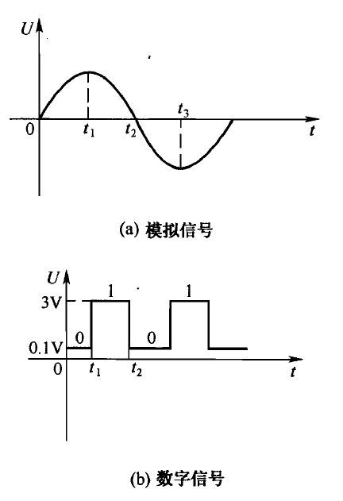

# 信号

[TOC]

## 概述

信号是携带信息的物理量，在电子电路中通常表现为电压或电流随时间变化的波形。

---

## 信号分类

### 按时间与幅度的连续性

| 类型 | 时间 | 幅度 | 示例 |
|------|------|------|------|
| 模拟信号 | 连续 | 连续 | 语音电压、温度传感器输出 |
| 数字信号 | 离散 | 离散 | TTL 方波、计算机数据总线 |

模拟信号：在时间上和幅度上都是连续变化的信号。大多数自然界的物理量（温度、声音、光强等）经传感器转换为模拟电信号。

数字信号：在时间上和幅度上均不连续的信号，只有高、低两个电平状态。具有抗干扰能力强、便于存储和处理等优点。

---

### 按变化规律

| 类型 | 定义 | 示例 |
|------|------|------|
| 周期信号 | 按一定时间间隔重复 | 正弦波、方波、三角波 |
| 非周期信号 | 不具有重复性 | 脉冲、噪声、随机振动信号 |

### 按确定性

| 类型 | 定义 | 示例 |
|------|------|------|
| 确定信号 | 可用数学函数精确描述 | 正弦波 f(t)=A·sin(ωt+φ) |
| 随机信号 | 无法用确定的数学关系预测 | 热噪声、电磁干扰 |

---

## 常见波形

### 正弦波 (Sine Wave)

最基本的周期信号，单一频率，无谐波：

- 表达式：v(t) = Vp·sin(2πft + φ)
- 应用：交流电源、RF 载波、测试基准信号

### 方波 (Square Wave)

高、低电平以等宽或不等宽交替出现：

- 占空比 = t(on) / T × 100%（50% 为对称方波）
- 偶数次谐波为零，仅含奇次谐波
- 应用：时钟信号、PWM 控制、数字电路

### 三角波 (Triangle Wave)

线性上升、线性下降：

- 含奇次谐波，幅度以 1/n² 递减
- 应用：函数信号发生器、扫描电路

### 锯齿波 (Sawtooth Wave)

缓慢线性上升后突然下降（或反之）：

- 包含丰富的奇偶次谐波
- 应用：CRT 显示器行/场扫描、开关电源锯齿波发生

### 脉冲信号 (Pulse)

短暂出现的高/低电平：

- 特征参数：幅度、脉宽、上升时间、下降时间
- 应用：触发信号、编码信号、瞬态事件

---

## 信号的数学描述

### 时域分析

以时间为横轴，直接观察波形形状和幅度。

- 幅度（Amplitude）：信号强度的最大值
- 周期（T）：重复一次的时间
- 频率（f）：f = 1/T
- 相位（φ）：信号相对于参考零点的时间偏移
- 上升/下降时间（tr / tf）：幅度从 10% 到 90% 的切换时间
- 脉宽（ τ ）：脉冲持续的时间

### 频域分析

以频率为横轴，观察信号中各个频率成分的幅度和相位。通过 **傅里叶变换** 将时域信号转换为频域表示。

- **频谱**：信号在不同频率上的幅度分布
- **带宽**：信号有效占用的频带宽度
- **谐波**：基频的整数倍频率成分

> 任何周期信号都可以表示为一系列不同频率、不同幅度的正弦波的叠加（傅里叶级数）。

---

## 信号失真

信号在传输或处理过程中可能产生失真：

| 失真类型 | 原因 | 表现 |
|----------|------|------|
| 幅度失真 | 放大器非线性 | 波形压顶/削底（削波） |
| 频率失真 | 系统带宽不足 | 高频成分丢失，方波变圆 |
| 相位失真 | 相频特性非线性 | 各频率成分延时不同 |
| 噪声叠加 | 电磁干扰、热噪声 | 信号上出现随机毛刺 |
| 反射 | 阻抗不匹配 | 过冲、振铃 |

---

## 调理与转换

### 信号调理 (Signal Conditioning)

为使传感器输出的微弱/非标准信号能被后续电路处理，需进行调理：

- **放大**：将微弱信号放大到合适范围（运放、仪表放大器）
- **滤波**：去除噪声和不需要的频率成分（低通、高通、带通、带阻）
- **线性化**：补偿传感器的非线性
- **隔离**：电气隔离保护（光耦、变压器、隔离运放）

### 模数转换 (ADC, Analog-to-Digital Conversion)

将模拟信号转换为数字信号，关键参数：

- **分辨率**（bit）：如 12-bit ADC 分辨率为 1/4096
- **采样率**（SPS）：每秒采样次数，须满足 **奈奎斯特采样定理**（采样率 ≥ 2× 信号最高频率）
- **量化误差**：±0.5 LSB

### 数模转换 (DAC, Digital-to-Analog Conversion)

将数字信号还原为模拟信号，常用于：
- 音频播放、任意波形产生
- 工业控制模拟量输出（4~20 mA / 0~10 V）

---

## 常用信号特征参数

| 参数 | 符号 | 定义 |
|------|------|------|
| 峰值 | Vp | 信号在参考零电平以上的最大正值 |
| 峰-峰值 | Vpp | 信号最高与最低点的差值 |
| 有效值 (RMS) | Vrms | 对正弦波：Vrms = Vp / √2 ≈ 0.707 Vp |
| 平均值 | Vavg | 对对称正弦波：Vavg = 0（全波整流后 = 0.637 Vp） |
| 占空比 | D | 高电平持续时间与周期的比 |

---

## 信号发生源

| 类型 | 原理 | 特点 |
|------|------|------|
| RC/LC 振荡器 | 正反馈 + 选频网络 | 中低频正弦波 |
| 晶体振荡器 | 石英晶体压电效应 | 频率精度高（ppm 级） |
| 555 定时器 | RC 充放电 | 简单方波发生器 |
| DDS (直接数字合成) | 查表 + DAC | 频率精准、可任意波形 |
| PLL (锁相环) | 压控振荡器 + 反馈 | 倍频/分频、频率合成 |
