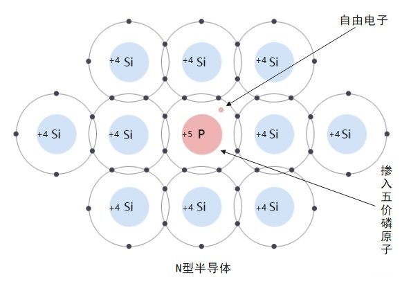
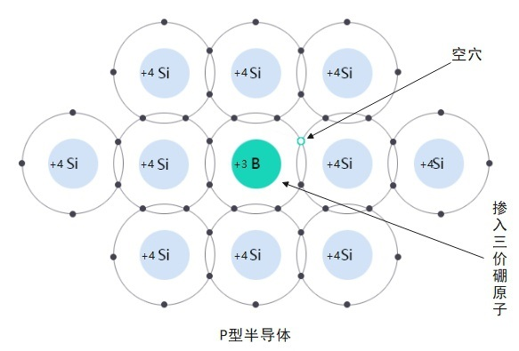

# 半导体

[TOC]

## 概述

半导体是导电能力介于导体和绝缘体之间的一类材料，其电导率在 10⁻⁶ ~ 10⁶ S/m 范围（20°C），且可通过温度、光照、掺杂等手段在很大范围内调控。

### 三大基本特性

1. **热敏特性**：温度升高 → 本征半导体的导电能力显著提高（负温度系数）
2. **光敏特性**：纯净的半导体受到光照时 → 导电能力显著提高（光生电子-空穴对）
3. **掺杂特性**：在纯净半导体中加入微量的"杂质"元素 → 电导率成千上万倍地增长

> 掺杂特性是制造各种半导体器件的理论基础。百万分之一级别的掺杂即可彻底改变导电性能。

---

## 本征半导体

不含任何杂质的纯净单晶半导体（如纯硅单晶）。

- 在绝对零度时，所有价电子被共价键束缚 → 不导电（类绝缘体）
- 温度升高或光照时，部分价电子获得足够能量挣脱共价键 → 产生**自由电子-空穴对**（本征激发）
- 电子和空穴均参与导电，且数量相等：n = p = n(i)

| 材料 | 本征载流子浓度 n(i) (300 K) | 禁带宽度 E(g) (eV) |
|------|:---:|:---:|
| 硅 (Si) | 1.5 × 10¹⁰ cm⁻³ | 1.12 |
| 锗 (Ge) | 2.5 × 10¹³ cm⁻³ | 0.67 |
| 砷化镓 (GaAs) | 1.8 × 10⁶ cm⁻³ | 1.42 |

> 锗的禁带宽度小，温度稳定性差；硅禁带适中，是集成电路的首选材料。

---

## 杂质半导体

### N 型半导体（电子型半导体）

在本征半导体（硅/锗）中掺入微量**五价元素**（砷 As、锑 Sb、磷 P 等）。

- 五价原子有 5 个价电子，4 个与周围硅原子形成共价键
- 多余的 1 个价电子，只需很小的能量即可脱离原子成为自由电子 → **施主杂质**
- 主要靠**电子**导电（多子为电子，少子为空穴）

### P 型半导体（空穴型半导体）

在本征半导体（硅/锗）中掺入微量**三价元素**（铟 In、硼 B、铝 Al 等）。

- 三价原子只有 3 个价电子，与周围硅原子形成共价键时缺少 1 个电子 → 产生一个**空穴**
- 邻近的价电子很容易跳入该空穴 → 空穴移动（等效为正电荷移动）→ **受主杂质**
- 主要靠**空穴**导电（多子为空穴，少子为电子）

---

## PN 结

将 P 型半导体和 N 型半导体制作在同一块硅片上，在交界面处形成 **PN 结**——几乎所有半导体器件的基本结构。

### PN 结的形成

- 交界处，P 区空穴浓度远高于 N 区 → 空穴向 N 区扩散
- N 区电子浓度远高于 P 区 → 电子向 P 区扩散
- 扩散后，交界处形成**空间电荷区**（耗尽层），P 侧带负电，N 侧带正电
- 空间电荷区产生**内建电场**，方向由 N → P，阻止多子继续扩散
- 扩散与漂移达到动态平衡时，PN 结形成

### PN 结的单向导电性

| 偏置方式 | 状态 | 耗尽层 | 电流 |
|----------|------|:---:|:---:|
| 正向偏置（P 接正、N 接负） | 导通 | 变窄 | 大（正偏电流呈指数增长） |
| 反向偏置（P 接负、N 接正） | 截止 | 变宽 | 极小（反向饱和电流 I(S)） |
| 反向击穿（反向电压过高） | 击穿导通 | — | 急剧增大 |

### 击穿类型

| 类型 | 机理 | 典型应用 |
|------|------|---------|
| 雪崩击穿 | 高电场加速少子碰撞电离 → 雪崩倍增 | 高反压二极管 |
| 齐纳击穿 | 强电场直接将共价键电子拉出（隧道效应） | 稳压管 (< 5.6 V) |
| 热击穿 | 反向电流发热 → 温度升高 → 电流更大 → 恶性循环 → 烧毁 | 器件损坏 |

---

## 半导体材料分类

### 元素半导体

| 材料 | 符号 | 特点 |
|------|:---:|------|
| 硅 | Si | 集成电路基石，丰富、工艺成熟 |
| 锗 | Ge | 早期晶体管材料，高温稳定性差 |

### 化合物半导体

| 材料 | 符号 | 特点 | 应用 |
|------|:---:|------|------|
| 砷化镓 | GaAs | 电子迁移率高、直接带隙 | RF 功放、发光器件 |
| 氮化镓 | GaN | 宽禁带 (3.4 eV)、高耐压 | 快充、雷达 |
| 碳化硅 | SiC | 宽禁带 (3.26 eV)、高导热 | 电动汽车主驱、充电桩 |
| 磷化铟 | InP | 高频特性优异 | 光通信激光器 |

---

## 常用掺杂元素

| 元素 | 符号 | 价态 | 掺杂类型 | 用途 |
|------|:---:|:---:|:---:|------|
| 硼 | B | 三价 | 受主 → P 型 | 常用 P 型掺杂 |
| 磷 | P | 五价 | 施主 → N 型 | 常用 N 型掺杂 |
| 砷 | As | 五价 | 施主 → N 型 | 高效 N 型掺杂 |
| 锑 | Sb | 五价 | 施主 → N 型 | |
| 铟 | In | 三价 | 受主 → P 型 | |
| 铝 | Al | 三价 | 受主 → P 型 | |

---

## 基于 PN 结的常见器件

| 器件 | 原理 | 功能 |
|------|------|------|
| 二极管 | 单个 PN 结 | 整流、检波、开关 |
| 稳压管 (齐纳二极管) | 反向击穿区恒压 | 电压基准、保护 |
| 发光二极管 (LED) | 正偏电子-空穴复合发光 | 指示、照明、显示 |
| 光电二极管 | 光照 → 光生载流子 → 电流 | 光检测 |
| 太阳能电池 | 大面积 PN 结的光生伏打效应 | 光伏发电 |
| 变容二极管 | 反偏耗尽层宽度随电压变化 → 结电容变化 | 电调谐 |
| 三极管 (BJT) | 两个背靠背 PN 结 | 放大、开关 |
