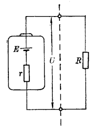
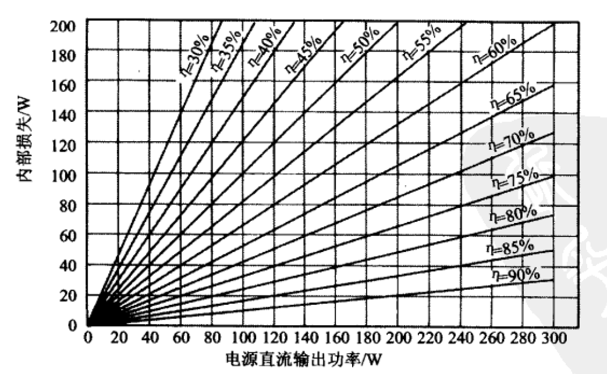

# 电源

[TOC]

## 概念

### 直流电源

1. 电池作为直流电源。
2. 采用整流和滤波电路将交流电转换成直流电源。

### 电动势与电压

1. 电动势和电压的物理意义不同，电动势表示了外力（非电场力）做功的能力，而电压表示电场做功的能力。
2. 电动势只存在于电源的内部，大小等于外力将单位正电荷从电源负极经电源内部移动到正极所做的功；而电压存在于电源的两端，并且存在于电源外部电路中，即电路中的两点。
3. 电动势有方向，并且与电压方向相反，电动势方向是电位升高的方向，而电压方向是电位降低的方向。电动势在电源内部的方向是从电源的负极指向电源的正极，而电压在外电路中的方向是从电源的正极指向电源的负极。
4. 电动势和电压的单位相同，都是伏特，用E表示。
5. 当电源两端不接负载时，电源两端的电压在数值上等于电源的电动势。

### 电源端电压

电源端电压等于电源正、负极之间的电位差。一般所说的电源电压，就是电源端电压。

### 电源内阻

在电源内部存在一个电阻，称为电源的内阻。电源的内阻对电源的工作不利，越小越好。

如内阻不变，电源的负载的阻值在变化，则不同的负载电阻有不同的电路电流，电源端电压大小也是不同的。

 

### 恒压源

当电源的输出电流大小在改变时，电源的输出电压恒定不变。当电源的内阻为0时，电源就是一个恒压源。

电压源视为恒压源与电阻串联。

### 恒流源

当电源的输出电压大小改变时，电源的输出电流不随电压变化而变化。当电源的内阻为无穷大时，电源就是一个恒流源。

电流源视为恒流源与电阻并联。

### 空载、轻载

空载指负载电路与电源电路之间断开了。

轻载指电源电路负载阻抗比较大，这时电源对负载的输出电流比较小。当电源负载阻抗大到无穷大时，就成了电源空载。

一般的电源电路在电源空载时不受任何影响，但有些例外，将会造成电源电路输出的直流工作电压增大，从而损坏电源电路中的元器件。

在不允许电源空载的电源电路中，有的会设置相应的保护电路，以防止电源空载时对电源电路的损坏。

### 过载

电源电路的负载电路存在短路，是电源电路输出了很大的电流，且超过了电源所能承受的范围。

## 电压变化原因

1. 交流电源电压的变化

   商用电源，电压会有波动。且附近有大型设备启动时，可能带来电压大幅下降。

2. 变压器的电压降

   变压器内部导线的电阻，产生电压降。

   初级和次级之间存在的漏电感引起电压降。

3. 整流二极管的电压降

4. 波纹电压

   波纹电压可看成是以2倍的电源频率连续变化的电压脉动。

5. 负载变化

## 直流稳压电源分类

* 线性稳压电源
  * 串联稳压电源
  * 并联稳压电源
* 开关稳压电源

### 对比

|              | 线性电源                                 | 开关电源                                                     |
| ------------ | ---------------------------------------- | ------------------------------------------------------------ |
| 使用场景     | 电压精度（稳定性）要求高或小功率的场合。 | 不适用于无线电设备、测量仪器、医疗器械之类处理极微弱信号的设备。 |
| 结构         | 简单                                     | 复杂                                                         |
| 可靠性       | 高                                       | 低                                                           |
| 转换效率     | 低                                       | 高                                                           |
| 电气噪声     | 少                                       | 大                                                           |
| 直流输出纹波 | 小                                       |                                                              |
| 功率损耗     | 大                                       | 小                                                           |
| 变压器体积   | 大                                       | 小                                                           |

## 交流稳压电源

## 制作建议

1. 装配时电源变压器应直接安装到金属外壳的后部。
2. 保险丝、电源开关和接线端子也安装在外壳后面板上。
3. 电路板应固定牢靠。
4. 在电路板上二极管或者整流器组件与滤波电容和电压调节元件尽可能紧靠放置。
5. 保证稳压器的有效散热。
6. 在外壳前面放置电源输出插孔。
7. 在外壳上钻孔帮助散热。
8. 外壳接地。
9. 电源线从后面板的孔中引出，在出口使用一个橡皮圈。
10. 为避免电击，确认所有的裸露的电源连接点都用热塑管隔离。

## 转换效率

η	    转换效率。

PL      电源内部的功率损耗。

PO     输出功率。

VO     输出电压。

IO      输出电流。
$$
P_{L} = \left ( \frac{1}{\eta } \right ) - 1 \ast P_{O} \\ P_{O} = V_{O}  \ast I_{O}
$$

通常，串联稳压器输出电压越低，转换效率越差。

 
