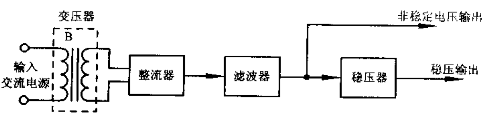

# 开关稳压电源

开关电源工作时，处于高电压、大电流、高频率的特殊工作状态。调整元器件工作在开关状态，即通过调整开关元器件的开关时间来实现稳压。

开关电源具有体积小、重量轻、功耗小、稳压范围宽等特点。

## 拓扑

线性调整器

Buck调整器

Boost调整器

反相开关型调整器（反激式或Buck-Boost调整器）

## 结构图

## 整流电路

## 滤波电路

## 稳压电路

## 保护电路

1. 过电压保护电路
2. 过电流保护电路
3. 整流二极管保护电路
4. 局部单元电路故障保护电路