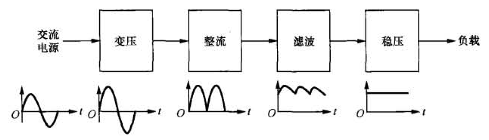
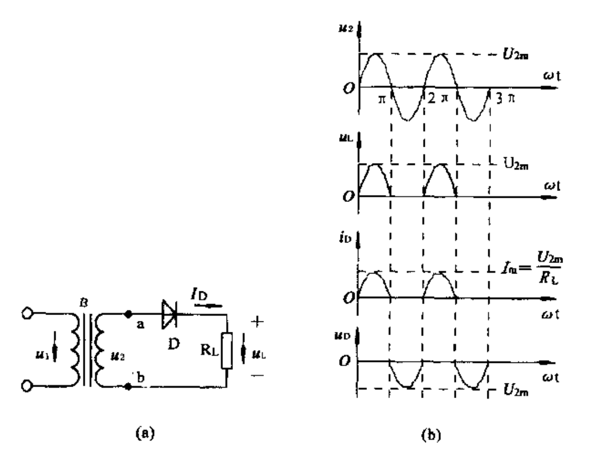
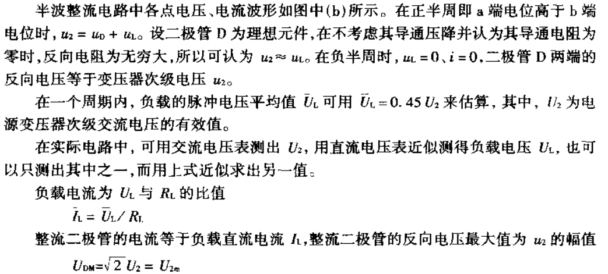
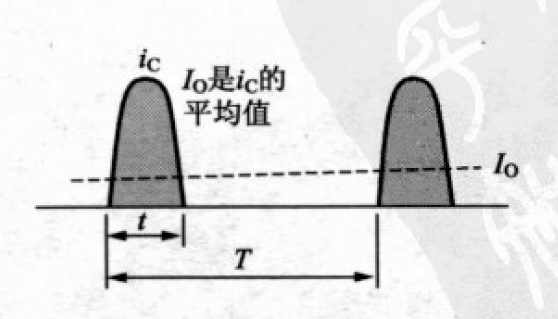
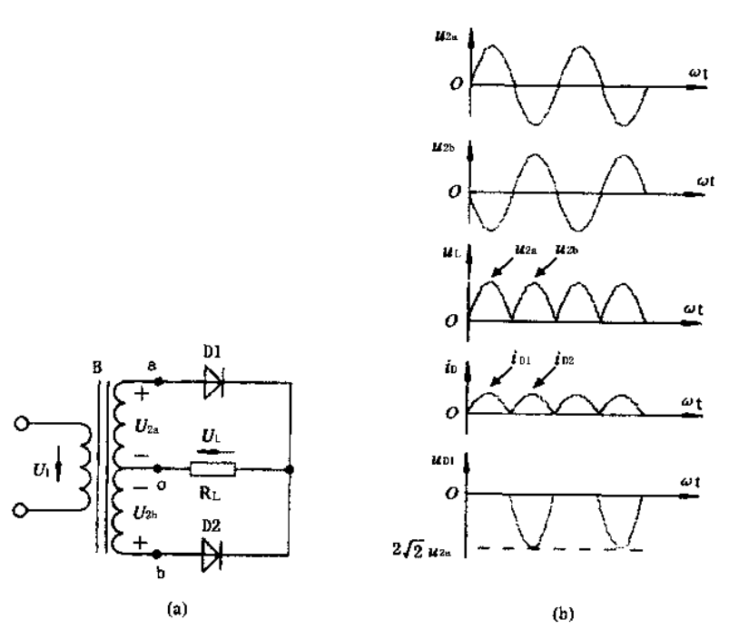
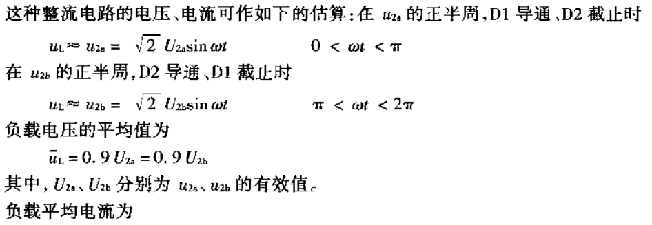
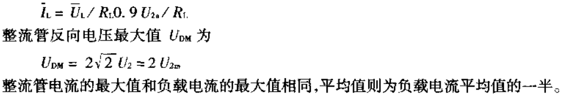
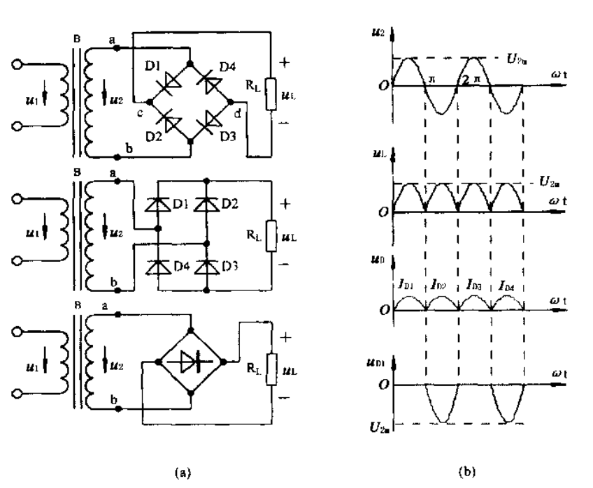
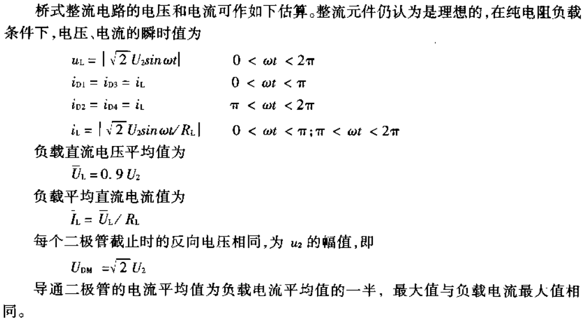
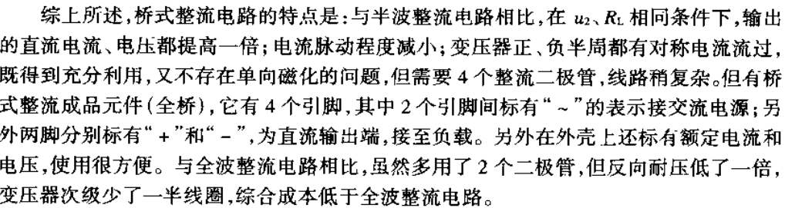

# 线性稳压电源

[TOC]

## 概述

一般由变压、整流、滤波和稳压这四大部分电路组成。

线性电源的优点是稳定性好、可靠性高、输出电压精度高、输出纹波电压小。

缺点是由于采用了工频变压器和滤波器，体积和重量都很大。调整管的功耗较大，使电源的效率较低，一般情况下电源效率均不会超过 50% 。

## 降压电路

将交流电网电压变成所需的交流电压。

### 交流降压电路

1. 电源变压器降压电路

   最常用，安全，有对 220V 交流市电隔离的作用。

2. 电容器降压电路

   经济，安全性差，很少采用。

3. 恒压变压器降压方式

### 直流降压电路

1. 阻容滤波器构成的直流降压电路
2. 电子滤波器构成的直流降压电路
3. 串联二极管或者串联稳压二极管的方式降低电压
4. 大量采用电阻分压电路进行局部电流电压降低

## 整流电路

将交流电压变成直流电压。

**电容器输入型整流：**在二极管整流电路的后面连接平滑电容器的整流方式

### 1.半波整流电路

 

 

IO     直流输出电流。

iC      电容器充电电流。
$$
I_{O} = \frac{1}{T} \int_{0}^{t} i_{C} \ast dt
$$
**优点：** 电路简单，元件少。

**缺点：** 输出的直流电压脉动很大，变压器的利用率低。仅适用于输出数十毫安的小功率电路。

### 2.全波整流电路

**优点：** 相比半波整流电路，负载电流和电压各增加一倍，电流脉动值减少。

**缺点：** 变压器的利用率不高，整流管的数量增加了一倍，每个整流管承担的方向电压最大值也增加了一倍。

### 3.桥式整流电流

### 4.倍压整流电路

## 滤波电路

将整流所得的脉动直流电中的交流成分滤除。

### 电容滤波器

### RC滤波器

### LC滤波器

### L型滤波

### π型滤波

### 电子滤波器

### 对比

| 滤波形式 | 优点                                       | 缺点                                         | 适用条件                             |
| -------- | ------------------------------------------ | -------------------------------------------- | ------------------------------------ |
| 电容滤波 | 输出电压高，滤波效果好                     | 负载能力弱，浪涌电流大                       | 负载电流较小的场合                   |
| 电感滤波 | 负载能力好，能适应变动负载，无浪涌电流     | 铁芯元件体积大、笨重，输出电压低，反电动势大 | 适用于负载变化大的场合               |
| Γ型滤波  | 输出大电流时负载能力好，效果比L、C滤波都好 | 输出电压低，反电动势大，铁芯元件体积大、笨重 | 适用于负载变化大而且负载电流大的场合 |
| π型滤波  | 输出电压高，滤波效果好                     | 负载能力弱，输出电流小                       | 适用于要求稳输出，输出电流小的场合   |

## 高频抗干扰电路

设置在 交流市电的输入回路中，作用是消除从电网中可能混入的各种干扰信号，防止这些高频干扰信号通过电源电路窜入整机电路。主要采用电感电路实现。

## 稳压电路

将滤波电路输出的直流电压稳定不变，即使输出直流电压不随电网电压、负载等的变化而变化。

### 稳压二极管稳压电路

### 串联调整管稳压电路

### 并联调整管稳压电源

### 集成电路稳压电路

### DC / DC 变换器