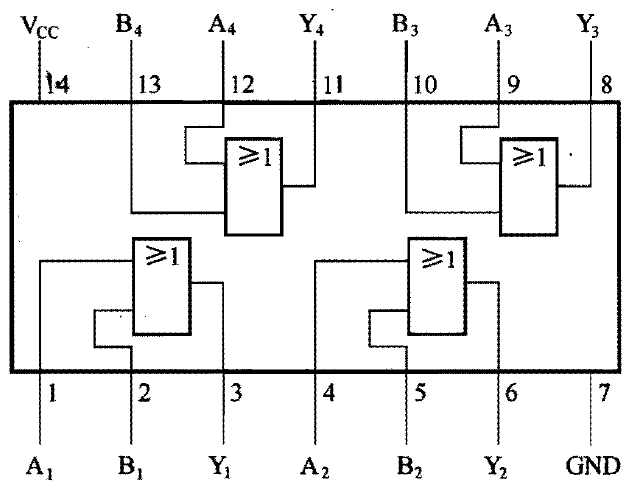

# 或门

[TOC]

## 概述

或门电路的功能是：只要有一个输入端为高电平，输出端就输出高电平；只有输入端都为低电平，输出端才会输出低电平。

## 真值表

<table border="1">
<tr>
  <th colspan="2">输入</th><th>输出</th>
</tr>
<tr>
  <td>A</td><td>B</td><td>Y</td>
</tr>
<tr>
  <td>0</td><td>0</td><td>0</td>
</tr>
<tr>
  <td>0</td><td>1</td><td>1</td>
</tr>
<tr>
  <td>1</td><td>0</td><td>1</td>
</tr>
<tr>
  <td>1</td><td>1</td><td>1</td>
</tr>
</table>

## 逻辑表达式

$$
\Huge Y = A + B
$$

## 图形符号

 

## 常见芯片

### 74LS32

内部有 4 个或门，每个或门有 2 个输入端、1 个输出端。

 