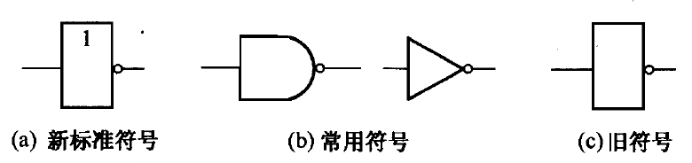
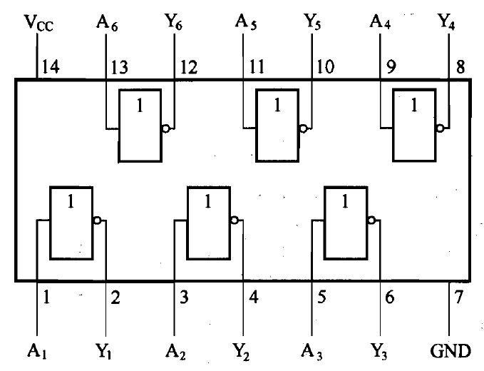

# 非门

[TOC]

## 概述

非门电路的功能是：输入与输出状态总是相反的。

## 真值表

<table border="1">
<tr>
  <th>输入</th><th>输出</th>
</tr>
<tr>
  <td>A</td><td>Y</td>
</tr>
<tr>
  <td>0</td><td>1</td>
</tr>
<tr>
  <td>1</td><td>0</td>
</tr>
</table>

## 逻辑表达式

$$
\Huge Y = \overline{A} 
$$

## 图形符号

 

## 常见芯片

### 74LS04

是一种常用的非门芯片（又称反相器）。内部有 6 个或门，每个或门有 1 个输入端、1 个输出端。

 