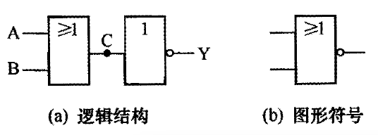
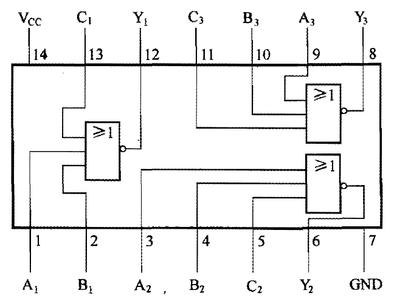

# 或非门

[TOC]

## 概述

或非门电路是由或门和非门组成的。

或非门的逻辑功能是：只有输入端全为 0 时，输出端才为 1 ；只要有一个输入端为 1 ，输出端就为 0 。

## 真值表

<table border="1">
<tr>
  <th colspan="2">输入</th><th>输出</th>
</tr>
<tr>
  <td>A</td><td>B</td><td>Y</td>
</tr>
<tr>
  <td>0</td><td>0</td><td>1</td>
</tr>
<tr>
  <td>0</td><td>1</td><td>0</td>
</tr>
<tr>
  <td>1</td><td>0</td><td>0</td>
</tr>
<tr>
  <td>1</td><td>1</td><td>0</td>
</tr>
</table>

## 逻辑表达式

$$
\Huge Y = \overline{A + B}
$$

## 图形符号

 

## 常见芯片

### 74LS27

内部有 3 个或非门，每个或非门有 3 个输入端、1 个输出端。

 