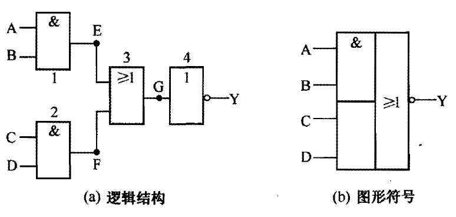
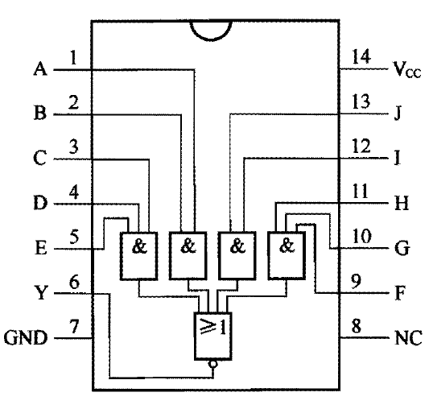

# 与或非门

[TOC]

## 概述

与或非门电路是由与门、或门和非门组成的。

与或非门的逻辑功能是：只要 A 、B 输或 C 、D 端中有一组全为 1 ，输出端就为 0 ；否则输出端就为 1 。

## 真值表

<table border="1">
<tr>
  <th colspan="4">输入</th><th>输出</th>
</tr>
<tr>
  <td>A</td><td>B</td><td>C</td><td>D</td><td>Y</td>
</tr>
<tr>
  <td>0</td><td>0</td><td>0</td><td>0</td><td>1</td>
</tr>
<tr>
  <td>0</td><td>0</td><td>0</td><td>1</td><td>1</td>
</tr>
<tr>
  <td>0</td><td>0</td><td>1</td><td>0</td><td>1</td>
</tr>
<tr>
  <td>0</td><td>0</td><td>1</td><td>1</td><td>0</td>
</tr>
<tr>
  <td>0</td><td>1</td><td>0</td><td>0</td><td>1</td>
</tr>
<tr>
  <td>0</td><td>1</td><td>0</td><td>1</td><td>1</td>
</tr>
<tr>
  <td>0</td><td>1</td><td>1</td><td>0</td><td>1</td>
</tr>
<tr>
  <td>0</td><td>1</td><td>1</td><td>1</td><td>0</td>
</tr>
<tr>
  <td>1</td><td>0</td><td>0</td><td>0</td><td>1</td>
</tr>
<tr>
  <td>1</td><td>0</td><td>0</td><td>1</td><td>1</td>
</tr>
<tr>
  <td>1</td><td>0</td><td>1</td><td>0</td><td>1</td>
</tr>
<tr>
  <td>1</td><td>0</td><td>1</td><td>1</td><td>0</td>
</tr>
<tr>
  <td>1</td><td>1</td><td>0</td><td>0</td><td>0</td>
</tr>
<tr>
  <td>1</td><td>1</td><td>0</td><td>1</td><td>0</td>
</tr>
<tr>
  <td>1</td><td>1</td><td>1</td><td>0</td><td>0</td>
</tr>
<tr>
  <td>1</td><td>1</td><td>1</td><td>1</td><td>0</td>
</tr>
</table>

## 逻辑表达式

$$
\Huge Y = \overline{A \cdot B + C \cdot D}
$$

## 图形符号

 

## 常见芯片

### 74LS54

内部有 1 个与或非门。

 