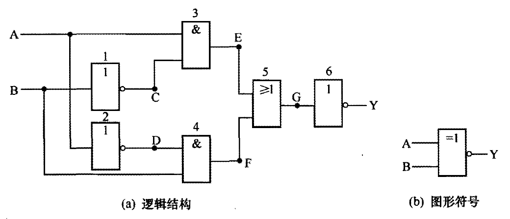
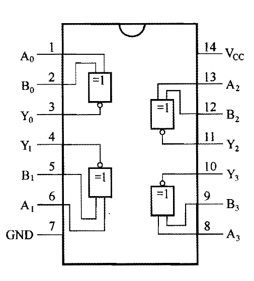

# 同或门

[TOC]

## 概述

同或门又称异或非门，电路是在异或门的输出端加上一个非门组成的。

同或门的逻辑功能是：当两个输入端一个为 0 、另一个为 1 时，输出端才为 0 ；当两个输入端同时为 1 或同时为 0 时 ，输出端就为 1 。

## 真值表

<table border="1">
<tr>
  <th colspan="2">输入</th><th>输出</th>
</tr>
<tr>
  <td>A</td><td>B</td><td>Y</td>
</tr>
<tr>
  <td>0</td><td>0</td><td>1</td>
</tr>
<tr>
  <td>0</td><td>1</td><td>0</td>
</tr>
<tr>
  <td>1</td><td>0</td><td>0</td>
</tr>
<tr>
  <td>1</td><td>1</td><td>1</td>
</tr>
</table>

## 逻辑表达式

$$
\Huge Y = A \cdot B + \bar{A} \cdot \bar{B} = A \odot B
$$

## 图形符号

 

## 常见芯片

### 74LS266

内部有 4 个同或门，每个同或门有 2 个输入端、1 个输出端。

 