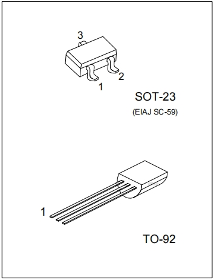
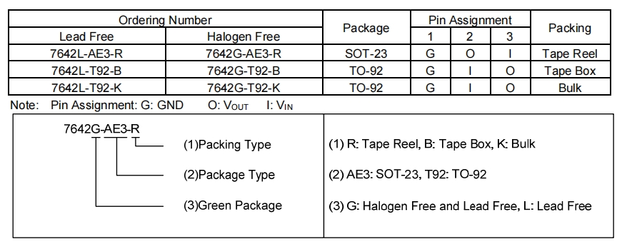
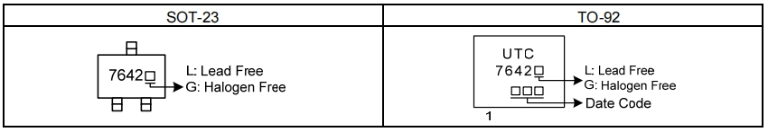
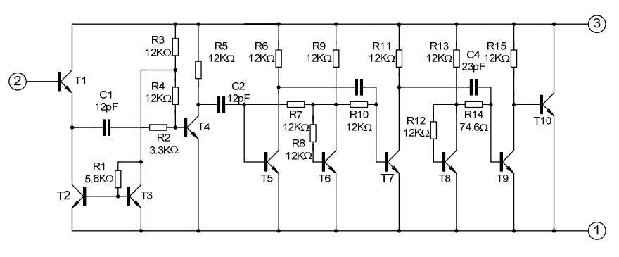
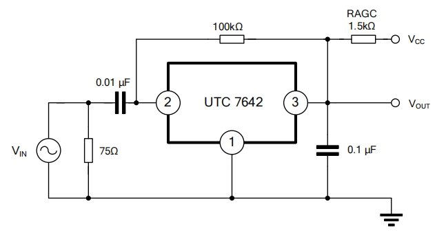
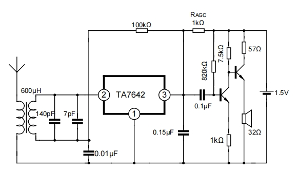

# TA7642

[TOC]

## 概述

LINEAR INTEGRATED CIRCUIT线性集成电路

ONE CHIP AM RADIO CIRCUIT一个芯片调幅无线电电路

The TA7642 is suitable for low voltage portable

Radio, cassette system and other wireless AM

system. The package of UTC7642 is TO-92.

UTC 7642适用于低压便携式收音机、盒式磁带系统和其他无线调幅系统。

 

FEATURES特征

*Low operating voltage: Down to VCC=1.3V

*Low Quiescent Current:ICCO=0.2mA

*Low external component required.

低工作电压：降至VCC=1.3V*低静态电流：ICCO=0.2mA*需要低外部组件。

ORDERING INFORMATION订购须知

 

MARKING标记

 

EQUIVALENT CIRCUIT等效电路

 

ABSOLUTE MAXIMUM RATINGS 绝对最大额定参数(Tested at TA=25°C,unless otherwise specified除非另有说明) 

| Parameters参数                | Symbols         | Min. | Max. | Unit |
| ----------------------------- | --------------- | ---- | ---- | ---- |
| Supply Voltage电源电压        | VCC  |      | 6    | V    |
| Operating Temperature运行温度 | TOPR | -10  | 60   | ℃    |
| Storage temperature储存温度   | TSTG | -55  | 150  | ℃    |

> Note: Absolute maximum ratings are those values beyond which the device could be permanently damaged. 
>
> Absolute maximum ratings are stress ratings only and functional device operation is not implied.
>
> 绝对最大额定值是指那些超过这些值后，设备可能会被永久损坏的值。绝对最大额定值仅为应力额定值，并不暗示功能设备的操作

ELECTRICAL CHARACTERISTICS  电特性(Tested at TA=25°C,VCC=1.3V,fm=1kHz,fO=1MHz,MOD=30%,unless other specified)

| Parameters                            | Symbols         | Test conditions试验条件 | Min. | Typ. | Max. | Unit |
| ------------------------------------- | --------------- | ----------------------- | ---- | ---- | ---- | ---- |
| Supply Voltage                        | VCC  |                         | 1.2  | 1.3  | 1.6  | V    |
| Quiescent Current静态电流             | ICCQ | VI=0         | 0.14 | 0.20 | 0.30 | mA   |
| Input Resistance输入电阻              | RI   |                         | —    | 3    | —    | MΩ   |
| Maximum sensitivity最高灵敏度         | SM   | VOD=3mV      | —    | 600  | —    | μV   |
| Detector Output Voltage检测器输出电压 | VOD  | VI=10mV      | 5    | 15   | 30   | mV   |
| The Range of AGCAGC的范围             | ∆A              |                         | —    | 30   | —    | dB   |

TEST CIRCUIT测试电路

 

APPLICATION CIRCUIT作用电路

 

