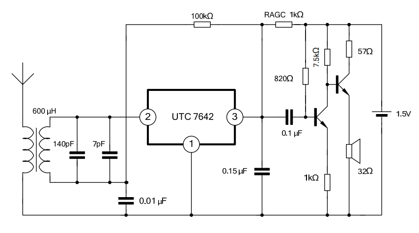
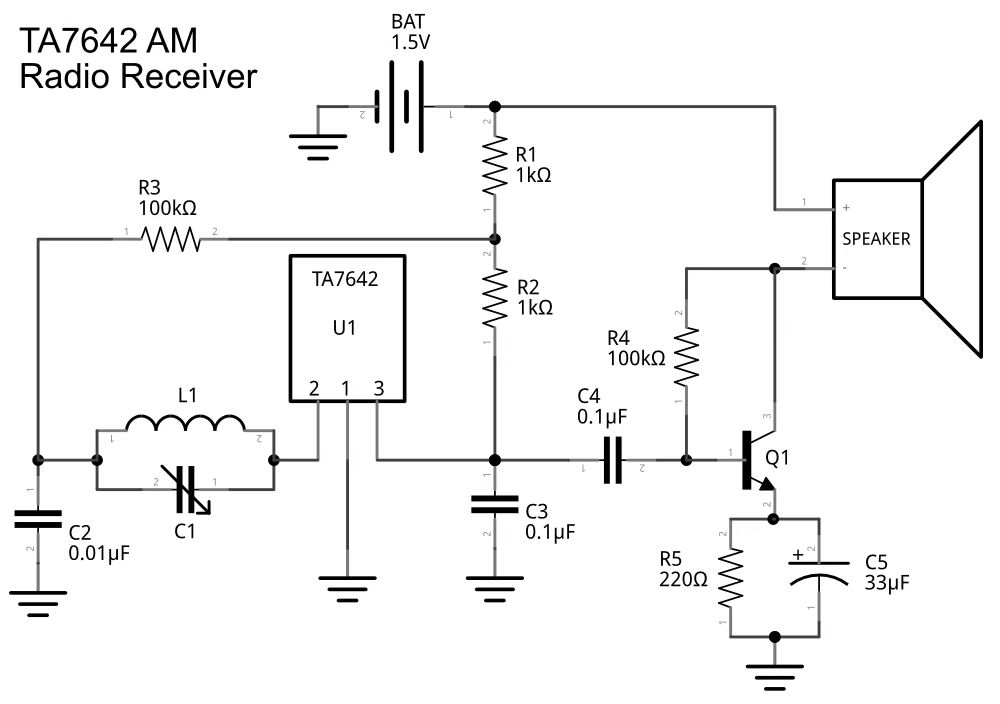

# TA7642

[TOC]

## 概述

线性集成电路

直放式中波收音机芯片

ONE CHIP AM RADIO CIRCUIT一个芯片调幅无线电电路

UTC 7642 / TA7642 适用于低压便携式收音机、盒式磁带系统和其他无线调幅系统。

The package of UTC7642 is TO-92.

 

## 特征

* 低工作电压：降至 VCC=1.3V

* 低静态电流：ICCO=0.2mA

* Low external component required.需要低外部组件。

## 订购须知

 

## 标记

 

## 等效电路

 

## 绝对最大额定参数

Tested at TA=25°C,unless otherwise specified除非另有说明)

| 参数     | Symbols         | Min. | Max. | Unit |
| -------- | --------------- | ---- | ---- | ---- |
| 电源电压 | VCC  |      | 6    | V    |
| 工作温度 | TOPR | -10  | 60   | ℃    |
| 储存温度 | TSTG | -55  | 150  | ℃    |

> **Note：** 
>
> Absolute maximum ratings are those values beyond which the device could be permanently damaged. 
>
> Absolute maximum ratings are stress ratings only and functional device operation is not implied.
>
> 绝对最大额定值是指那些超过这些值后，设备可能会被永久损坏的值。
>
> 绝对最大额定值仅为应力额定值，并不暗示功能设备的操作

## ELECTRICAL CHARACTERISTICS  电特性

Tested at TA=25°C,VCC=1.3V,fm=1kHz,fO=1MHz,MOD=30%,unless other specified

| 参数                                  | Symbols         | 试验条件           | Min. | Typ. | Max. | Unit |
| ------------------------------------- | --------------- | ------------------ | ---- | ---- | ---- | ---- |
| 电源电压                              | VCC  |                    | 1.2  | 1.3  | 1.6  | V    |
| 静态电流                              | ICCQ | VI=0    | 0.14 | 0.20 | 0.30 | mA   |
| Input Resistance输入电阻              | RI   |                    | —    | 3    | —    | MΩ   |
| Maximum sensitivity最高灵敏度         | SM   | VOD=3mV | —    | 600  | —    | μV   |
| Detector Output Voltage检测器输出电压 | VOD  | VI=10mV | 5    | 15   | 30   | mV   |
| AGC的范围                             | ∆A              |                    | —    | 30   | —    | dB   |

## 测试电路

 

## APPLICATION CIRCUIT作用电路

 

 

 