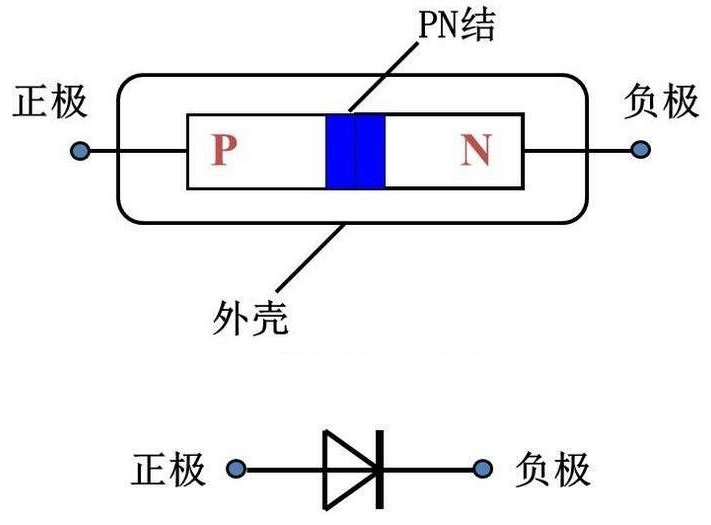
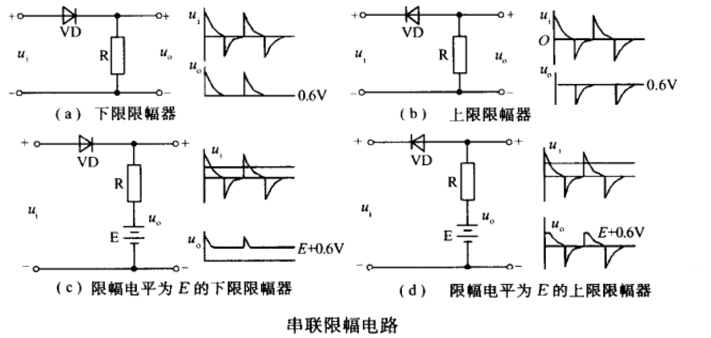
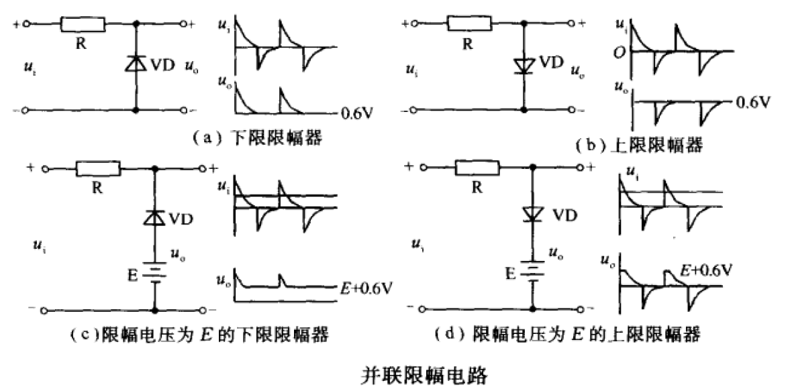
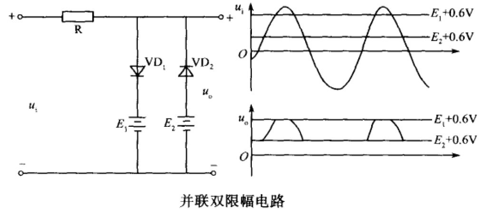
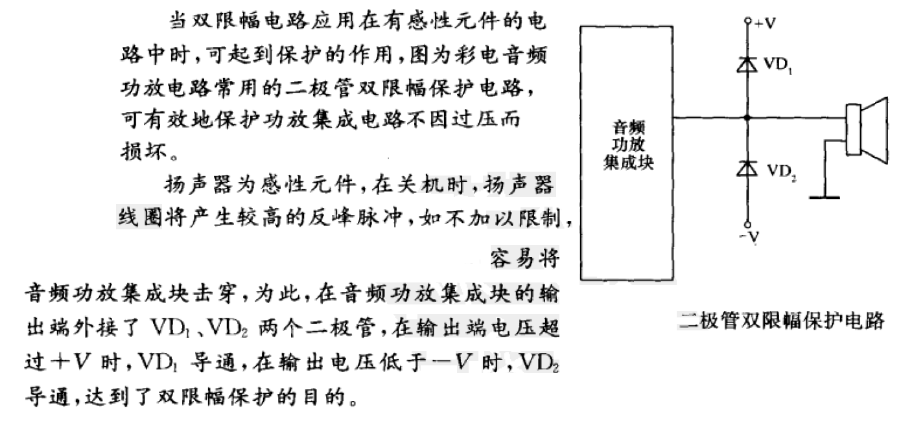

# 二极管

[TOC]

## 概述

 

## 原理

将一个纯净的硅片一半掺入硼原子，另一半掺入磷原子会形成 PN 结。

 

右边 N 型半导体中有比较多的自由电子，P 区几乎没有自由电子，**由于浓度差不同，电子会从 N 区向 P 区移动**，与其中的空穴结合，这样在中间就形成了薄薄的一层接触区。

P 侧接触区增加了电子所以带负电，N 侧减少了电子所以带正电，这样这个薄薄的接触面就成了一个带电的电场，学名叫做**内建电场**，电场的方向从 N 区指向 P 区:

 

内建电场与浓度差产生相反的效果，**会推动电子从P区移动到N区。**最终，在浓度差和内建电场共同的作用下，电子在接触区内来来回回，这个接触区达到了一定的动态平衡。这个接触区叫做 **PN 结**。

给硅片加上一个与内建电场相反的外部电场（正极接 P 区，负极接 N 区），外部电压会削弱内部电压，内部电压越来越小最后近乎没有，并且 N 区自由电子在外部电场作用下逐渐增多。

 

**内建电场减小，浓度差增大**，电子会源源不断从N区流向P区，这时的 PN 结导通，就像一个导体。

如果给这个硅片加上反向外部电场（正极接 N 区，负极接 P 区），外部电压与内建电场同向，会加强内部电压，内部电压变得很大，同时 N 区自由电子在外部电场作用下减少。

 

**内建电场增大，浓度差减少**，内部电压会阻碍电子流向P区，这时的PN结不导电，就像一个绝缘体。

## 分类

1. 半导体材料：锗二极管，硅二极管，砷化镓二极管
2. 用途：开关二极管，整流二极管，发光二极管，稳压二极管，光电二极管，隧道二极管，肖特基二极管，检波二极管，变容二极管，高压硅堆二极管，阻尼二极管，温敏二极管，磁敏二极管，瞬态抑制二极管TVS
3. 结构：点接触型二极管，面接触型二极管，平面型二极管
4. 封装：塑料封装二极管，金属封装二极管，玻璃封装二极管，树脂封装二极管  

## 参数

| 二极管类型 | 导通所需的最小正向电压 | 电阻范围 |
|------------|------------------------|----------|
| 硅管       | 0.7V                   | 4-8K     |
| 锗管       | 0.15V                  | 1K       |

1. 最大整流电流

   二极管长期连续工作时允许通过的最大正向电流值。

2. 最高反向工作电压

   加在二极管两端的反向电压高到一定值时，会将二极管击穿，失去单向导电能力。

3. 反向电流

   二极管在规定的温度和最高反向电压作用下，流过二极管的反向电流。

4. 最大整流电流下的正向电压降

   当正向电流流过时，两端会产生正向电压降。越小越好。

5. 最高工作频率

   由于 PN 结存在结电容和扩散电容，二极管最高工作频率受到限制。

## 伏安特性曲线

## 特殊二极管

### 稳压二极管

也称齐纳二极管(Zener Diodes)，与一般二极管不同之处是它正常工作于 PN 结的反向击穿区，具有稳定电压作用。

由一个 PN 结组成，反向击穿后，在一定的电流范围内端电压基本不变，为稳定电压。

符号：

主要参数：

* 稳定电压 UZ

  稳压管反向击穿后的稳定工作电压值。

* 动态电阻 rZ

  稳压管在稳定工作范围内管子两端电压的变化量与相应电流变化量之比：
  $$
  r_{z}=  \frac{\triangle U_{Z} }{\triangle I_{Z} }
  $$

* 稳定电流 IZ

  * 稳定电流是稳压管工作时的参考电流值，手册上给出的稳定电压和动态电阻都是指在这个电流下的值。
  * 工作电流若小于稳定电流，则  rZ 增大，稳定性能较差。
  * 工作电流若大于稳定电流，则  rZ 减小，稳定性能较好，但要注意管子的功率损耗不要超出允许值。

* 额定功耗 PZM

  * 是由管子允许温升限定的最大功耗损耗。
  * 如已知管子的稳定电压值，额定功率除以稳定电压就是该稳压管允许的最大稳定电流 IZM = PZM / UZ 。超过这个电流使用，可能损坏管子。

* 

### 检波二极管

结电容小，频率特性好，正向压降小，通常用锗材料点接触式结构。  
2AP系列，1N60

## 选择方式
1. 点接触型：高频检波、混频;小电流整流
2. 面接触型：低频

## 应用

### 整流电路

[电源](../../强电/电源/电源.md)

### 限幅电路

限幅器是完成削去波形某一部分的电路，利用它对脉冲的波形进行变换或整形。

#### 串联限幅电路

* 上限幅电路
* 下限幅电路

#### 并联限幅电路

### 钳位电路

### 稳压电路

## 其他

### 极间电容

PN 结的两块半导体之间构成一个电容量很小的电容。由于电容的容抗随频率的增高而减小。所以 PN 结工作于高频时，高频信号容易被极间电容或反馈而影响 PN 结的工作。PN 结面积越大，极间电容量越大，影响也越大。