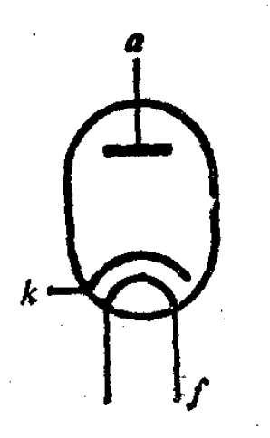
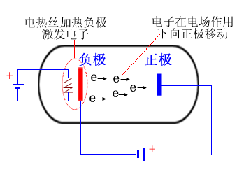
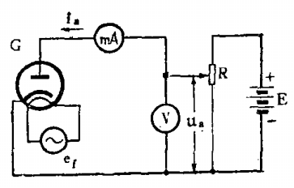
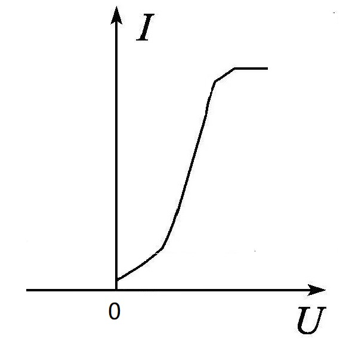

# 二极管

[TOC]

## 概述

是最简单的一种电子管。是一个密封的玻璃管（或金属管），管内被抽成高度真空。其中安装两个电极，一个是阴极，一个是屏极。

 

* 灯丝	f

  阴极的热源。

* 阴极    k

  通常由发射温度低而效率高的材料制成，如金属氧化物、钨、碳化钍钨等，作用是发射热电子。

* 屏极    a

  通常由镍、镀镍铁片或钼、钽等材料制成，作用是收集热电子。为使热电子全部顺利地到达屏极，做成了圆筒形，套在阴极外边。

## 工作原理（单向导电性）

 

## 伏安特性曲线

测量电路：

 

特性曲线是非线性。阴极在不同的工作温度下，有不同的曲线。当屏压一定时，温度越高，屏流越大。二极管伏安特性曲线描述屏流及屏压间的关系。

 

阴极加热后不断发射出电子来，如果屏极未加屏压，这些电子会在阴极附近的空间堆积起来，形成一个包围圈，称为空间电荷。空间电荷的存在排斥着继续从阴极发射出来的电子，把一部分速度较小的电子推回阴极，但速度较大的电子仍然能够从阴极发射出来。在一定温度下，当被推回去与发射出来的电子数目相等时，就达到了一种平衡状态，称为动平衡。这时，空间电荷的厚度不再改变。但仍有少数速度很大的电子，克服空间电荷的排斥而到达屏极，这就是特性曲线起始处未加屏压却有微小屏流的原因。

当屏极加上不大的正电压时，屏极与阴极之间形成电场，对空间电荷的电子产生一种吸引力，把一部分初速度较大的电子吸了过来，到达屏极形成屏流。由于这时的电场强度不大，初速较小的电子还不能突破空间电荷的阻力，更无法跑到屏极上去。所以屏流虽有增加，但不显著。表现在特性曲线下半部分缓慢上升的一段。

随着屏压的增加，吸引电子的电场强度增加，越来越多的电子脱离空间电荷而跑到屏极，同时电子飞向屏极的速度也增大了，所以这时屏流增加更快，与屏压不成正比例的增加，表现在特性曲线逐渐向上弯曲的一段。

当屏压继续增大到足够大时，阴极发射的电子会全部被吸引去，空间电荷完全消失，这时即使屏压再继续增加，屏流也不会再增加，表现在特性曲线上出现平直的一段。目前所应用的氧化物阴极二极管在未到达这种状态以前阴极就会被烧毁，故特性曲线一般不画出这段。

## 3/2次方定律

特性曲线上升部分的特性有个近似的代数式：
$$
\Huge i_{a} = Gu_{a}^{\frac{3}{2} }
$$

* G	常数，由二极管的构造决定。

## 参数

### 内阻 Ri
在额定灯丝电压下，直流屏极电压 Ua  对直流屏极电流 Ia 的比值。
$$
\Huge R_{i} = \lim_{\Delta I_{a} \to 0} \left ( \frac{\Delta U_{a}}{\Delta I_{a}} \right )
$$
等于特性曲线上某点的切线斜率的倒数。

对应于各工作点的内阻不相同。手册内的内阻，是在特性曲线的运用范围内，各工作点的内阻的平均值。常称为直流内阻。

### 直流电阻 R

特性曲线上某点的屏流电压 Ua  与对应的屏流电流 Ia 的比值。
$$
\Huge R = \frac{ U_{a}}{ I_{a}}
$$

$$
\Huge R_{i} = \frac{2}{3} R
$$

### 屏极损耗功率 Pa

电子受到屏极电场的加速，撞到屏极上，电子的动能转化为热能，使屏极温度升高。这些热量是无用的损耗，叫做屏极损耗。  

等于屏极与阴极之间的电压与屏流的乘积。  
$$
\Huge P_{a} = U_{a}I_{a}
$$
**害处：**

1. 屏极温度过高，金属内残余的气体释放，破坏真空度。
2. 屏极发热，会导致阴极额外受热，氧化物阴极在过热时，会很快失去发射电子的能力。

**应对：**
1. 屏极进行黑化（表面变成黑色），增加辐射散热率。
2. 增加屏极面积，增加侧面板。

### 最大屏极反峰电压
在二极管加上阴极为正，屏极为负的反向电压时，这个电压的最大容许值。

在实际整流电路中，电子管工作时，负载前通常并接了大容量的电解电容，所有两端实际存在的反向电压接近为电源电压峰值的两倍。

如果电压超过了屏极和阴极之间的绝缘强度时，会使二极管击穿而损坏。同时，阴极表面电场过强，有把氧化物阴极损坏的危险。

### 最大整流电流
二极管允许连续不断的通过的最大平均屏极电流值。

超过这个值，会使阴极与屏极温度过高而损坏。

### 最大峰值屏流
二极管在安全范围内容许的最大瞬时屏流值。决定于阴极的发射能力。负载电流不得超过最大屏流。

在整流管工作时，最大峰值屏流的大小与采用的滤波电路有关：

* 输出端采用电感输入式滤波，峰值屏流不会比负载电流大很多。
* 输出端采用电容输入式滤波，峰值屏流可能数倍于负载电流。（如电容量很大时，电容器的瞬间充电电流很大，为安全起见，使用时第一只滤波电容的容量不宜很大。）

### 灯丝额定电源 Uf

保证阴极正常发射电子所需的工作电压。

## 用途

* 整流
* 检波

