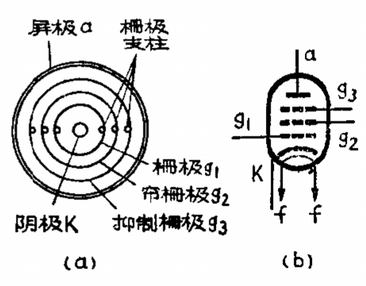
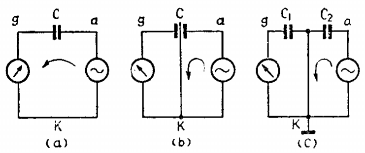
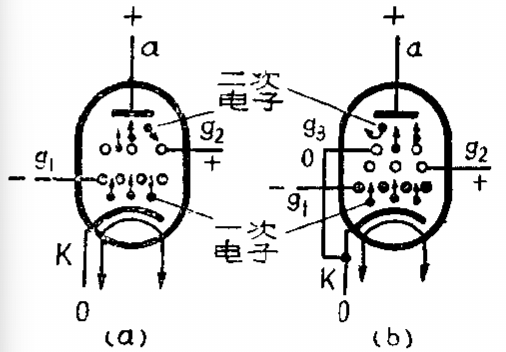
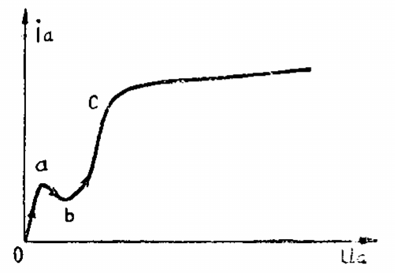
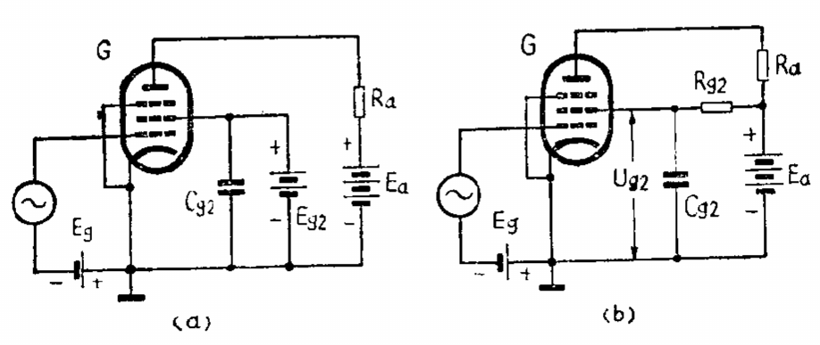
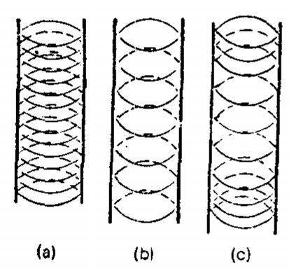
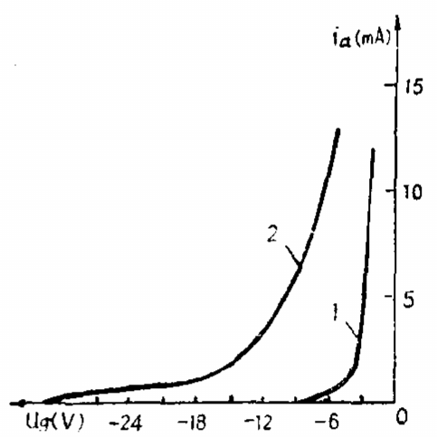
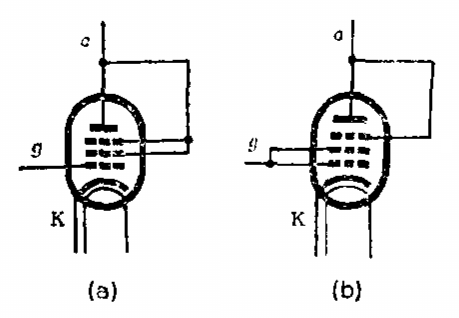

# 五极管

[TOC]

## 概述

在三极管的栅极和屏极之间加入另外两个栅极，成为五极管。

 

## 栅极

* 控制栅极

* 帘栅极

  利用屏蔽的原理，减少栅极与屏极间的跨路电容。需接地，且必须接上正电压，以免影响屏流。

   

* 抑制栅极

  消除在屏极上产生的二次电子发射的影响。从阴极发射的电子受到屏极和帘栅极正电场的加速作用而以高速撞击屏极，使屏极表面的电子获得足够的动能而飞出屏极，飞出去的电子称为二次电子。阴极发射的电子称为一次电子。抑制栅极与阴极相连，二次电子被抑制极排斥返回屏极。
  
   
  
  如不考虑抑制栅极的作用，当屏压从零增加时，屏流随着屏压的增加而增加，0-a 。当屏压增加到一定程度，但是仍低于帘栅压时，屏极在电子撞击下开始发射二次电子，所产生的二次电子就被电位较屏极为高的帘栅极所吸收，因此屏流减少，a-b 。屏压越高，一次电子的速度越大，二次电子的数目越多，屏流因而越小。直到屏压接近帘栅压后，屏极开始把二次电子吸回，屏流才由减小转为增加，b-c 。由于二次电子发射，电子管屏压和屏流的关系变成不规则的，如用来作放大器，将会出现失真。
  
   

## 电路图
 

* Cg2	帘栅极旁路电容
* Rg2    帘栅降压电阻
* Ig20    帘栅极电流的直流分量
* fd       电子管工作时的最低频率

$$
\Huge R_{g2} = \frac{ E_{a} - U_{g2} } { I_{g20} } \\
\Huge C_{g2} \geq \frac{ 3 }{ 2\pi f_{ d } R_{ g2 } }
$$

## 特性曲线

因帘栅极加上正电压，吸收部分电子形成帘栅流，所以阴极电流是屏流和帘栅流之和。

屏极受到三个栅极的屏蔽，对阴极发射的电子影响极微，决定阴极电流的是栅极压和帘栅极电压，几乎与屏压无关。所以屏流近似于一常数，至于阴极电流在屏极和帘栅极上的分配比率，取决于屏极电压和帘栅极电压的相对大小。

## 优缺点

### 优点

* 放大系统比较大。
* 帘栅极和抑制栅极的双重屏蔽作用，跨路电容非常小，可以工作于较高的频率。

### 缺点

* 屏极特性曲线族在屏压较低时，曲线间的间隔不均匀，用作放大器时会引起失真。
* 由于电子运动的不规律性，使屏极与帘栅极之间的电流分配会随时间而发生不规则的波动，引起噪声。失真和噪声比三极管大。

## 分类

根据管内结构上的差别和使用上的不同要求分类。

### 锐截止五极管

栅极是用金属丝均匀的绕制成下图所示形状 a 。

 

栅极金属丝细密、均匀，并且靠近阴极，这样用较小的负栅压就能使屏流立即截止。如曲线图 1 。

 

由于栅极距离阴极很近，栅压的变化对屏流的控制能力较强，因此放大系数较高。常用作高频电压放大或前置电压放大。

常见型号：

* 6J1
* 6J2
* 6J8P

### 低频功率放大五极管

在低频放大时，极间电容的影响较小，帘栅极不需要很好的屏蔽，同时用作功率放大时，要求有较大的功率输出，因而阴极电流就比一般电压放大管大得多，这需要加上较高的帘栅压，因此帘栅极绕的较为稀疏。这样可以容许加上较大帘栅压（一般和屏压相等）而帘栅流又不至于很大。

栅极也绕的稀疏，如图 b ，并且距离阴极较远，是栅压对屏流的控制能力较弱，要用较大的负栅压才能使屏流截止，所有能允许加上较大的输入信号电压以提高输出功率，放大系数和内阻都比锐截止五极管低。

常用型号：

* 6P14

### 遥截止五极管

栅极构造比较特别，栅丝绕的不均匀，上下两端绕的密而中间绕的稀疏，如图 c 。

当负栅压较小时，特性和锐截止管相同，当负栅压增大到一定程度时，栅极上下两端较密的部分阻止电子通过，而中间稀疏的部分仍能通过电子，随着栅负压的增大，能通过的电子越来越小，直到负栅压很大时，屏流才会截止。这样屏栅特性曲线的下部弯曲部分就拖得很长。如图曲线 2 。这种电子管的跨导是可变的，当负栅压小时跨导较大，而负栅压增大时跨导较小，所以也叫做变跨导五极管或可变放大系数五极管。常用在超外差式收音机中具有自动增益控制电路的中频放大级。

常见型号：

* 6K4
* 6K3P

## 三极管接法

某些情况下，可以把五极管接成三极管来使用。

 

* 低放大系数接法

  把帘栅极和抑制栅极都与屏极相连当做屏极来使用，屏压对屏流的影响增大，放大系数较低。

* 高放大系数接法

  把抑制栅极和屏极相连，帘栅极和栅极相连当。由于帘栅极较密，屏压要透过两个栅极才能作用到阴极表面，因而屏压对屏流的影响较小，放大系数较高。
