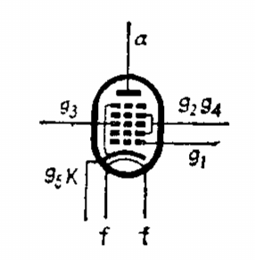

# 多栅管

[TOC]

## 概述

多栅管是指具有三个以上栅极的电子管，如六极管、七极管、八极管等。

## 七极管

最常用的多栅管。各个栅极分别以第一栅、第二栅 ...... 第五栅来表示。

通常在超外差式收音机内作变频用。相当于一个三极管和一个五极管混合在一起。

g1 、g2 和阴极组成一个三极管振荡器，此时 g1 作为栅极，g2 相当于屏极。

g3 、g4 、g5 、屏极和 g1 与 g2 之间聚集的空间电荷相当于一个阴极而组成一个五极管混频器。其中 g3 相当于五极管的栅极，g4 相当于帘栅极，g5 则相当于抑制栅极。

 

### 常见型号

* 6A2
* 6A7P