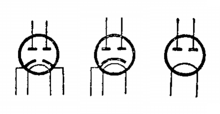
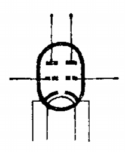
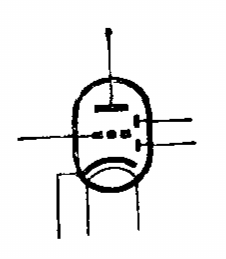
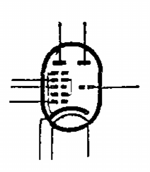

# 复合管

[TOC]

## 概述

在一个电子管的管壳内装有两个或两个以上独立的电子管，在管壳内的各个电子管是完全独立的，工作互不影响，因此一个电子管能具有多种用途。

## 常见种类

### 双二极管

管壳内部包含两个特性相同的二极管。

常用的有两种：

* 两个二极管各有独立的阴极，常用来做检波器。如 6H2 。
* 两个二极管有公用的阴极，常用来全波整流。如 6Z4 , 5Z2P , 5Z3P 。

 

### 双三极管

应用最广的一种电子管，用作电压放大器。由于在制造过程中两个三极管受到完全相同的处理以及同时处在完全相同的真空条件下，两管特性的一致性比较好，特别适用于要求两个三极管特性十分对称的地方。如倒相电路、直流放大器、触发器等。

 

常见型号：

* 6N1
* 6N2
* 6N8P
* 6N9P

### 双二极三极管

通常在收音机中用它的一个二极管部分做检波，另一个二极管部分做自动增益控制电路，三极管部分用作电压放大。

 

常见型号：

* 6G2
* 6G2P

### 双二极五极管

### 三极七极管

变频管，三极管部分做振荡，七极管部分做混频。

 

常见型号：

* 6U1