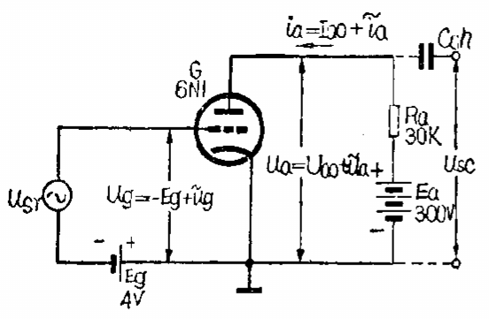
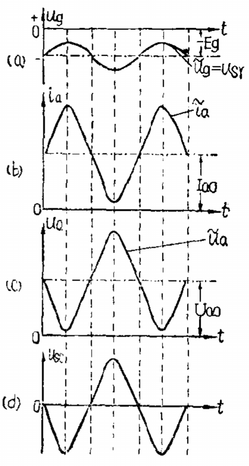

# 放大器

[TOC]

## 概述

在通信设备中，往往需要将微弱的信号电压加以放大之后，去推动功率放大器，使负载得到所需的信号功率。

## 电压放大器

在放大微弱信号电压时，放大器的输入量和输出量都是电压，而输入、输出电流都是非常微小的，通常不予考虑，这类放大器称为电压放大器。

 

当栅极没有信号电压输入时，电子管处于静止的工作状态。输入回路和输出回路中的电压、电流都是直流。

栅极回路只有栅偏压，屏极回路有一定的直流屏流。

Ra 的作用是把变化的屏流转变为输出电压。

输出电压与输入电压的相位相反，这种现象称为放大器的反相作用。

 

电子管放大电路的一个重要特点是电路中一般都同时存在着直流分量和交流分量两种成份。其中直流电流和电压决定电子管的直流工作状态；交流电流和电压代表这信号的变化情况。

## 功率放大器

