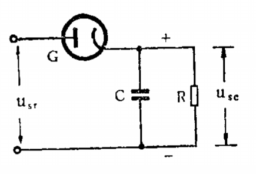

# 检波

[TOC]

## 电路

### 原理电路

 

* C      滤波电容，容量在 50 ~ 250 pF 。
* R      负载电阻，阻值在 200 k ~ 1M 。

输出波形：

 

输出波形并不是原来的正弦波，而是一个锯齿形波，可以分解为高频、低频和直流三个分量。

 

为使检波器的输出电压波形完全相似于输入调幅波的包络线，即不致产生检波失真，要求在输出端的高频分量幅度应尽可能小，要适当的选择负载电阻和电容的数值。

当电路的时间常数 τ = RC 较大时，C 放电的速度就慢，输出的锯齿波电压变化较小，即高频分量小。

但 τ 过大时，会产生另一种失真。如下图 e 点，在调幅波的包络线下降时，由于 τ 太大，自 e 至 f 的一段时间内输入的高频电压总是低于电容上的电压，因此这段时间是电容持续不断的向电阻放电，输出波形不能与包络线相似。

  