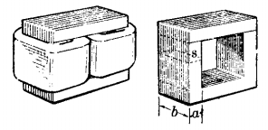
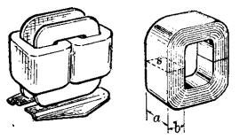
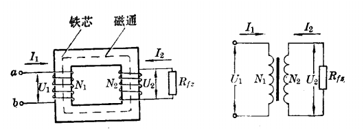

# 变压器

[TOC]

## 概述

变压器根据互感原理制成。

符号：B 或 T

## 结构及形式

基本结构有导线、硅钢片和绝缘材料等组成。

### 铁芯

铁芯是用一定形状的硅钢片叠成，硅钢片上涂有绝缘漆，使片与片之间彼此绝缘。变压器接上交流电源后，变化的磁力线穿过铁芯截面，在铁芯上产生感应电流，像旋涡一样流动，称为涡电流（简称涡流）。由于电流的热效应，涡流会引起铁芯发热。如涡流过大，不仅会损耗电能，降低效率，还会因铁芯过热是线圈绝缘破坏，导致变压器烧毁。

铁芯不用整块原铁，而用涂有绝缘材料的硅钢片制成，这样涡流仅仅流动于薄薄的硅钢片的横截面只能，增大了涡流回路的电阻，是涡流大大减小。

### 结构形式

#### 芯式（口型）

 

线圈分开绕在两个芯柱上，有较大的位置处置绝缘问题，适用于电压较高的场合。

#### 壳式（EI型）

 

线圈绕在中心柱上，不易碰伤先去，是小型变压器中最常用的。

#### C 型

 

铁芯是由冷轧硅钢带卷绕而成，体积小，重量轻，效率高。

#### R 型

#### 环型

## 变压比（电压比、匝变比）

 

$$
\Huge n = \frac{N_{1}}{N_{2}} = \frac{U_{1}}{U_{2}}
$$

* n             变压比。
* N1           一次绕组的匝数。
* N2           二次绕组的匝数。
* U1           一次绕组两端的输入电压。
* U2           二次绕组两端的输出电压。

## 空载电流

变压器不接负载时，初级线圈中的电流。大小取决于初级线圈的匝数、绕法与铁芯的质量。一般来说，线圈匝数越多，铁芯质量越好，空载电流越小，通常只有工作电流的1/5~1/2。空载电流越小，变压器本身损耗越小。

## 效率

## 用途

电压变换，阻抗变换，隔离，稳压，隔直流
## 分类
| 分类方法      | 类别 |
|--------------|---|
| 冷却方式      | 干式(自冷)，油浸式，氟化物 |
| 铁心或线圈结构 | 芯式，壳式，环型，金属箔   |
| 铁心形状      | E型，C型，环型           |
| 防潮方式      | 开放式，灌封式，密封式     |
| 用途         | 电源，调压，音频，中频，高频，脉冲，隔离，自耦，恒压，耦合 |
| 电源相数      | 单相，三相，多相         |

## 低频变压器
电源变压器，音频变压器
## 中频变压器（中周）

超外差式收音机内特有的元件。

单调谐式，双调谐式
## 高频变压器
天线线圈，振荡线圈，电视机天线阻抗变换器，行输出等脉冲变压器

## 隔离变压器

一次侧、二次侧绕组间有较高绝缘强度以隔离不同电位抑制共模干扰的专用变压器。隔离变压器的变比通常是1：1（但并非全部）。

隔离变压器属于安全电源，一般用来机器维修、保养用，起保护、防雷、滤波作用。

由于次级不和大地相连，次级任一根线与大地之间没有电位差，但使用安全。

控制变压器和电子管设备的电源也是隔离变压器。如电子管扩音机、电子管收音机与示波器，以及车床控制变压器等电源都是隔离变压器。如为了安全维修彩电常用1：1的隔离变压器。在空调中也有使用。

通常我们用的交流电源电压一根线和大地相连，另一根线与大地之间有220V的电位差。人接触会产生触电。而隔离变压器的次级不与大地相连，它的任意两线与大地之间没有电位差。人接触任意一条线都不会发生触电，这样就比较安全。

隔离变压器的输出端跟输入端是完全“断路”隔离的，这样就有效的对变压器的输入端（电网供给的电源电压）起到了一个良好的过滤作用。从而给用电设备提供了纯净的电源电压。

防干扰。可广泛用于地铁、高层建筑、机场、车站、码头、工矿企业及隧道的输配电等场所。

用隔离变压器使二次对地悬浮，只能用在供电范围较小、线路较短的场合。此时，系统的对地电容电流小得不足以对人身造成伤害。

​    

功率

变压器铁心磁通和施加的电压有关。在电流中励磁电流不会随着负载的增加而增加。虽然负载增加铁心不会饱和，将使线圈的电阻损耗增加，超过[额定容量](https://baike.baidu.com/item/额定容量)由于线圈产生的热量不能及时的散出，线圈会损坏 　假如线圈是由超导材料组成，电流增大不会引起发热，但变压器内部还有漏磁引起的阻抗，电流增大，输出电压会下降，电流越大，输出电压越低，所以变压器[输出功率](https://baike.baidu.com/item/输出功率)不可能是无限的。再假如变压器没有阻抗，那么当变压器流过电流时会产生特别大电动力，很容易使变压器线圈损坏，虽然功率无限但不能用。只能这样说，随着超导材料和铁心材料的发展，相同体积或重量的变压器输出功率会增大，但不是无限大! 

​    

一般变压器原、副绕组之间虽也有隔离电路的作用，但在频率较高的情况下，两绕组之间的电容仍会使两侧电路之间出现静电干扰。为避免这种干扰，隔离变压器的原、副绕组一般分置于不同的心柱上，以减小两者之间的电容；也有采用原、副绕组同心放置的，但在绕组之间加置静电屏蔽，以获得高的抗干扰性。

静电屏蔽就是在原、副绕组之间设置一片不闭合的铜片或非磁性导电纸，称为屏蔽层。铜片或非磁性导电纸用导线连接于外壳。有时为了取得更好的屏蔽效果，在整个变压器，还罩一个屏蔽外壳。对绕组的引出线端子也加屏蔽，以防止其他外来的电磁干扰。这样可使原、副绕组之间主要只剩磁的[耦合](https://baike.baidu.com/item/耦合)，而其间的等值[分布电容](https://baike.baidu.com/item/分布电容)可小于0.01pF，从而大大减小原、副绕组间的[电容电流](https://baike.baidu.com/item/电容电流)，有效地抑制来自电源以及其他电路的各种干扰。

### 分类

**普通隔离变压器**由于一次侧、二次侧绕组之间没有直接的电气连接，故一般的电力变压器不论变比为多少都具有电位隔离的功能，而隔离变压器则可以隔离更高的电位差。被广泛应用于交流电源线上、通信线上，隔离接地回路，有效抑制低频、音频范围内的共模干扰，但不能抑制差模干扰。信号与脉冲隔离变压器也广泛地应用在音频到视频范围，用于中断地环路，实现耦合交流、隔离直流成分、阻抗匹配等功能。由于隔离变压器的一次侧与二次侧之间存在分布电容，从而降低了接地回路阻抗。

**屏蔽隔离变压器**在隔离变压器的一次侧和二次侧之间插入一层金属屏蔽层，屏蔽层将一次侧与二次侧之间的电容分为两个，起到了屏蔽作用。如将金属屏蔽层与变压器接地端连接，则来自一次侧的共模干扰在到达二次侧前被屏蔽层阻抗旁路。如将金属层与变压器一次侧输入端(有调压抽头时接调压抽头或接地端和零线端)连接，来自一次侧的差模干扰在到达二次侧前也被屏蔽层短路。

**双重屏蔽隔离变压器**当一次侧同时出现共模和差模干扰时，将一层屏蔽层连接到一次侧以降低差模噪声，将另一层屏蔽层连接到共模干扰的基准面或地线上以降低共模噪声。隔离变压器外壳也被连接到安全地线上。屏蔽层的连接线必须短而可靠，否则在高频时，屏蔽效果明显降低。

**三重屏蔽的隔离变压器**当需要更高隔离要求的时候，可选用三重屏蔽的隔离变压器。三种不同屏蔽层的连接方法取决于变压器的安装方法以及接地条件。一般将变压器安装在设备机架的隔板或屏蔽室的隔墙上，并将机架接设备安全地线，输入电源安全地被断开加绝缘管保护。

　　隔离变压器是指输入绕组与输出绕组带电气隔离的变压器，隔离变压器用以避免偶然同时触及带电体，变压器的隔离是隔离原副边绕线圈各自的电流。早期为欧洲国家用在电力行业，广泛用于电子工业或工矿企业、机床和[机械](http://m.elecfans.com/article/778924.html)设备中一般[电路](http://www.hqpcb.com/zhuoluye9)的控制电源、安全照明及[指示灯](http://www.hqchip.com/app/106)的电源。

　　隔离变压器，主要的作用是将用电设备和电网隔离开。用于安全性场合或者抗干扰要求的场合等。用电设备和电源没有直接的电联系。  隔离式结构材料多，成本高，除了能改变电压外，还可以把输入绕组和输出绕组在电气上彼此隔离，输入/输出和零线隔离，用以避免同时触及带电体（或因绝缘损坏而可能带电的金属部件）和地所带来的危险。此外隔离变压器还具有一定抑制各种干扰的作用，具有滤波性能，且安全性高。

##  	　　控制变压器：

　　控制变压器顾名思义主要用来“控制”用，主要是把一-次电压变换到适合电器控制回路的电压。比如车床控制[电路](http://www.hqpcb.com/zhuoluye9)，为了车末操作人员的安全，一般将  车床控制电路降到367安全电压。这里就需要一个380/367的控制变压器。 当然，  这样的控制变压器也有隔离作用，因为它也需要把一-次和二次分隔成两个互不相关联的系统。有一些这样的变压器要求也比较高，中间加有专门接地的隔离层。如果你刚好能够接受这个一次和二次电压，这样的控制变压器也可以当作隔离变压器用。而且380V系统的分布[电容](http://www.elecfans.com/tags/电容/)可以忽略，一次与二次的绝缘问题也不是很大。但它不能叫做隔离变压器。

　　控制变压器是作为电气控制回路的供电电源使用的，目的是为了满足不同用电电气元件的电压需求。在低压配电系统中，控制变压器因多用于控制系统而得名。它实际上是一个具有多种输出电压的降压变压器，也可用做低压照明及信号灯、指示灯的电源。

##  	　　隔离变压器：

 	 　　隔离变压器主要用来“隔离”用，一次线圈和二次线圈Z间都是没有电的联系，一次线圈和二次线圈的匝数都是可以根据需要来定，没有电关联的系统。除了隔离没有其他作用，它的电压比应该是1:1。隔离变压器属于安全电源，一般用来机器维修保养用，起保护、防雷、滤波作用。隔离变压器原边和副边电压可根据要求订制。隔离变压器的输出端跟输入端是完全“[断路](http://www.hqpcb.com/zhuoluye9)”隔离的。
 	
 	　　隔离变压器是将变压器两端不同电压，经过隔离变压器隔离传送，使该变压器两端不同的电压不会相互干扰或影响，主要是隔离电源与负荷，使两边不存在直接电的联系，一般用在低压仪器及实验上。

##  	　　控制变压器和隔离变压器的区

###  	　　二、作用不同

 	　　控制变压器是为电气设备运行中为控制系统提供电源的；
 	
 	　　隔离变压器是为防止用电设备受电源的谐波干扰，实际它是个性能较差的[滤波器](http://www.elecfans.com/tags/滤波器/)，一般控制变压器输出电压有6.3V、12V、24V、36V、50V、
 	
 	　　110V、127V等，为降低成本，有些控制变压器只输出单一低电压，或三到五个电压。而隔离变压器一般地说变压比是1:1，两类变压器功能不同，因而无法通用。

###  	　　三、联系

 	　　比如在一个进口行车电气回路中，所有[继电器](http://www.elecfans.com/d/763963.html)[接触器](http://m.elecfans.com/article/630110.html)等电气都是220伏的，电源输入是3相4线的，本来可以直接利用零线组成控制回路的。但是这个行车有操控手柄，电气设计人员就利用了一个隔离变压器，次级作为电气控制回路的电源，由于这个次级回路没有接地端，即使人接触了这220伏的控制电压的其中一点也不会触电，所以这个变压器既是控制变压器，也是隔离变压器。
 	
 	　　在这里我们也可以看出，一个变压器名称的定义也是由变压器本身的用途决定的，如：起隔离作用的叫隔离变压器！

## 自耦变压器

　　自耦变压器是指它的绕组是初级和次级在同一条绕组上的变压器。根据结构还可细分为可调压式和固定式。自耦的耦是电磁[耦合](http://www.elecfans.com/tags/耦合/)的意思，普通的变压器是通过原副边线圈电磁耦合来传递能量，原副边没有直接电的联系，自耦变压器原副边有直接电的联系，它的低压线圈就是高压线圈的一部分。通信线路的防护设备中也会使用自耦变压器等保护设备。

　　自耦变压器是自耦合变压器，自耦式结构比较简单、成本低、输入/输出和零线共用，变压器的副边是原边的一部分，其一、二次侧共同用一个绕组，像是一个线出来的两个线圈，两个线圈是利用[电流](http://www.elecfans.com/tags/电流/)的忽大忽小的差来切割磁力线，来变压的，一般用在直流电的升压上，变压器的输出和输入有直接电联系，安全性能差。

###  	　　1、构造上的区别

 	　　隔离变压器是最常见变压器的一种，其低压、高压绕组分别由分离的线圈绕制并无电气上的连接，原边、副边没有直接电的联系、且次级绕组也不与大地做连接。
 	
 	　　自耦变压器原边、副边有直接电的联系，它的低压线圈就是高压线圈的一部分，即只有一个电器通路的绕组，绕组中间有一抽头作为高压和低压线圈的公共点。

###  	　　2、安全系数上的区别

 	 　　通常我们用的交流电源电压一根线和大地相连，另一根线与大地之间有220V或380V的电位差。人接触会产生触电。而隔离变压器的次级高低压线圈相互电气绝缘，也不与大地相连，它的任意两线与大地之间没有电位差。人接触任意一条线都不会发生触电，这样就比较安全。所以无论次级电压是否超过了安全电压值，只要人身不同时接触次级的两个有电压差的输出点，就不会对人造成伤害、这是隔离变压器**的优点。但体积大，成本高。
 	
 	　　自耦变压器因高低压线圈有重合的部分，所以节省了部分线圈导线材料，不仅体积小且成本较低。但它高低压线圈相连，既使是降压变压器的低压侧输出电压很低，因其两绕组有共用部分，所以初级的高压也会“窜入”次级的线圈中，对人极易造成伤害。

###  	　　3、使用上的区别

 	　　三相隔离变压器、主要用于电力系统、工矿企业的电力负荷、要求与电网隔离的电源化市电为磁电，作为精密[测量](http://www.hqchip.com/app/851)试验净化（抗干扰）电源与电力网的功率设备。隔离变压器属于安全电源，一般用于机器的维护保养起保护、防雷、滤波的作用。
 	
 	　　自耦变压器原边、副边有直接电的联系，如果要[线路破损](http://www.hqpcb.com/zhuoluye9)及漏电、对人极易造成伤害。一般用在安全要求不高的场所、只需要改变电压，使电压满足设备的需求电压，但是设备上不能带有漏电保护装置，零线不能接地。

　

　　我们都知道隔离变压器有两种，一种是干扰隔离变压器；另一种是电源隔离变压器，它们的相同点都是：一次和二次绕组圈数比都为1。

##  	　　**那么在什么情况下选择干扰变压器呢？**

 	　　当电子设备如电子仪表及工业控制计算机等如果直接在市电电网中，就会受到接在市电电网中的一些大功率电力电子装置中晶闸管的快速导通与截止以及各种大型设备的起、停造成的脉冲干扰。就需要选用隔离变压器。
 	
 	 　　电源隔离变压器有良好的绝缘性，所以在家用等产品中，为了降低成本、减小体积都直接用市电220v的电源进行整流，然后通过开关稳压电源给彩色电视机供电。这样就使220v电源的一根线直接与彩色电视机底板连通，即平时俗你的“热底板”。在维修彩色电视机时为防止不小心碰上  “热底板”而触电，可以选用电源隔离变压器。但需注意的是使用电源隔离变压器时，应注意隔离变压器的功率要大于负载电器的功率。
 	
 	　　这就是隔离变压器选用的一些原则

##  	　　**隔离变压器选型**

 	 　　隔离变压器的选择很简单就是，变压器总容量等于你所有负载容量再被功率因数除一下就是了。既然是隔离变压器，电压是固定的，确定了容量，就确定了电流。相电流多大，选多大线径那是变压器生产的设计部门的事，你计算的是对的，你的隔离变压器的容量就是27.4千伏安（变压器的容量不能够称为千瓦）。［单台最大负载电流*1.5~3  其余电动机额定电流之和］/0.85=变压器额定电流，由此可推算出变压器的容量了。
 	
 	　　**注：**
 	
 	　　0.85为变压器最佳运行电流的计算系数。
 	
 	　　得出变压器的容量后如还要留有其它设备的增容可能，因此应适当放大。

 	隔离变压器的作用主要是：使一次侧与二次侧的电气完全绝缘，也使该回路隔离。另外，利用其铁芯的高频损耗大的特点，从而抑制高频杂波传入控制回路。用隔离变压器使二次对地悬浮，只能用在供电范围较小、线路较短的场合。此时，系统的对地电容电流小得不足以对人身造成伤害。

##  	**普通变压器与隔离变压器的区别**

 普通变压器与隔离变压器的最显著的区别是：隔离变压器的二次侧与一次侧的零线不连通，这样就可以隔离一次侧的电磁干扰。于是有人说隔离变压器的二次侧两头都有电，对人身造成伤害。这是错误的想法。试想你搭一根线的话，由于另一端没有接地，根本就没有构成回路，怎么会有危险呢，隔离变压器的另一用处就是起到安全作用呀。

##  	**隔离变压器的原理**

隔离变压器的原理和普通变压器的原理是一样的。都是利用电磁感应原理。隔离变压器一般是指1：1的变压器。由于次级不和地相连。次级任一根线与地之间没有电位差。使用安全。常用作维修电源。

隔离变压器不全是1：1变压器。控制变压器和电子管设备的电源也是隔离变压器。如电子管扩音机，电子管收音机和示波器和车床控制变压器等电源都是隔离变压器。如为了安全维修彩电常用1比1的隔离变压器。隔离变压器是使用比较多的，在空调中也是使用的。

 一般变压器原、副绕组之间虽也有隔离电路的作用，但在频率较高的情况下，两绕组之间的电容仍会使两侧电路之间出现静电干扰。为避免这种干扰，隔离变压器的原、副绕组一般分置于不同的心柱上，以减小两者之间的电容；也有采用原、副绕组同心放置的，但在绕组之间加置静电屏蔽，以获得高的抗干扰性。

 静电屏蔽就是在原、副绕组之间设置一片不闭合的铜片或非磁性导电纸，称为屏蔽层。铜片或非磁性导电纸用导线连接于外壳。有时为了取得更好的屏蔽效果，在整个变压器，还罩一个屏蔽外壳。对绕组的引出线端子也加屏蔽，以防止其他外来的电磁干扰。这样可使原、副绕组之间主要只剩磁的耦合，而其间的等值分布电容可小于0.01pF，从而大大减小原、副绕组间的电容电流，有效地抑制来自电源以及其他电路的各种干扰。

##  	**隔离变压器作用**

隔离变压器属于安全电源，一般用来机器维修保养用起保护、防雷、滤波作用。  隔离变压器是一种1/1的变压器。初级单相220V，次级也是单相220V。或初级三相380V，次级也是三相380V。首先通常我们用的交流电源电压一根线和大地相连，另一根线与大地之间有220V的电位差。人接触会产生触电。而隔离变压器的次级不与大地相连，它的任意两线与大地之间没有电位差。人接触任意一条线都不会发生触电，这样就比较安全。其次还有隔离变压器的输出端跟输入端是完全“断路”隔离的，这样就有效的对变压器的输入端（电网供给的电源电压）起到了一个良好的过滤的作用，从而给用电设备提供了纯净的电源电压！

###  	**隔离变压器在交流电源输入端的特点：**

1.若电网三次谐波和干扰信号比较严重，采用隔离变压器，可以去掉三次谐波和减少干扰信号。

2.采用隔离变压器可以产生新的中性线，避免由于电网中性线不良造成设备运行不正常。

3.非线性负载引起的电流波形畸变（如三次谐波）可被隔离而不污染电网。

###  	**隔离变压器在交流电源输出端的特点：**

1.防止非线性负载的电流畸变影响到交流电源的正常工作及对电网产生污染，起到净化电网的作用。

2.在隔离变压器输入端采样，使得非线性负载电流的畸变不影响取样的准确性，得到能反应实际情况的控制信号。

3.若负载不平衡，也不影响稳压电源的正常工作。

##  	**隔离变压器**

 	隔离变压器是指输入绕组与输出绕组带电气隔离的变压器，隔离变压器用以避免偶然同时触及带电体，变压器的隔离是隔离原副边绕线圈各自的电流。早期为欧洲国家用在电力行业，广泛用于电子工业或工矿企业、机床和机械设备中一般电路的控制电源、安全照明及指示灯的电源。
 	
 	一次侧、二次侧绕组间有较高绝缘强度以隔离不同电位抑制共模干扰的专用变压器。隔离变压器的变比通常是1：1。
 	
 	隔离变压器属于安全电源，一般用来机器维修、保养用，起保护、防雷、滤波作用。
 	
 	隔离变压器的原理和普通变压器的原理是一样的。都是利用电磁感应原理。隔离变压器一般（但并非全部）是指1：1的变压器。由于次级不和大地相连。次级任一根线与大地之间没有电位差，使用安全。常用作维修电源。
 	
 	控制变压器和电子管设备的电源也是隔离变压器。如电子管扩音机、电子管收音机与示波器，以及车床控制变压器等电源都是隔离变压器。如为了安全维修彩电常用1：1的隔离变压器。在空调中也有使用。
 	
 	首先通常我们用的交流电源电压一根线和大地相连，另一根线与大地之间有220V的电位差。人接触会产生触电。而隔离变压器的次级不与大地相连，它的任意两线与大地之间没有电位差。人接触任意一条线都不会发生触电，这样就比较安全。
 	
 	其次，隔离变压器的输出端跟输入端是完全“断路”隔离的，这样就有效的对变压器的输入端（电网供给的电源电压）起到了一个良好的过滤作用。从而给用电设备提供了纯净的电源电压。
 	
 	另一用途是防干扰。可广泛用于地铁、高层建筑、机场、车站、码头、工矿企业及隧道的输配电等场所。
 	
 	隔离变压器是指输入绕组与输出绕组在电气上彼此隔离的变压器，用以避免偶然同时触及带电体（或因绝缘损坏而可能带电的金属部件）和大地所带来的危险，它的原理与普通干式变压器相同，也是利用电磁感应原理，主要隔离一次电源回路，二次回路对地浮空，以保证用电安全。

##  	**隔离变压器作用**

 	隔离变压器的主要作用是：使一次侧与二次侧的电气完全绝缘，也使该回路隔离。 另外， 利用其铁芯的高频损耗大的特点，  从而抑制高频杂波传入控制回路。  用隔离变压器使二次对地悬浮，只能用在供电范围较小、线路较短的场合。此时，系统的对地电容电流小得不足以对人身造成伤害。  还有一个很重要的作用就是保护人身安全！隔离危险电压。
 	
 	随着电力系统的不断发展，变压器作为电力系统中的关键设备起着日益重要的作用，它的安全运行直接关系到整个电力系统运行的可靠性。  变压器线圈变形是指线圈在受力后，发生的轴向、幅向尺寸变化、器身位移、线圈扭曲等情况。造成变压器线圈变形的主要原因有二个：一是变压器运行中难以避免地要受到外部短路故障冲击：二是变压器在运输吊装过程中发生意外碰撞。

 隔离变压器的原理和普通变压器的原理是一样的。都是利用电磁感应原理。隔离变压器一般是指1：1的变压器。由于次级不和地相连。次级任一根线与地之间没有电位差。使用安全。常用作维修电源。  隔离变压器的主要作用是：使一次侧与二次侧的电气完全绝缘，也使该回路隔离。 另外， 利用其铁芯的高频损耗大的特点，  从而抑制高频杂波传入控制回路。 用隔离变压器使二次对地悬浮，只能用在供电范围较小、线路较短的场合。

维修时为了确保人身安全和避免一些不必要的损失，最好在市电与电源输入端之间加接一个1:1隔离变压器接入AC220V电路中，以防触电。见（图1）  。如要使用示波器、扫描仪、信号发生器等设备检测电路，应将这些设备的三芯电源插头线的地线断开（图2） 。另外，检修时电源不能空载，必须加接280Ω  左右的假负载进行检查。

通变压器的首要任务是改变电压，分为降压变压器和升压变压器，原副边线圈匝数不相等。隔离并不是它主要的任务，甚至有的变压器原副边并不隔离，比如自耦变压器就是典型。

 　　隔离变压器的首要任务是将原副边绕组进行电绝缘隔离，因此对它的最基本要求是保证原副边绝缘性能。而变压并不是它的首要任务，多数的隔离变压器并不进行变压，即原副边绕组匝数相等。比如晶闸管直流调速系统中为了防止主电路高压侵入脉冲数控装置而使用的脉冲变压器也是典型。

　　隔离变压器（Isola[TI](http://bbs.elecfans.com/zhuti_715_1.html)on   transformer）俗称安全变压器，是指输入绕组与输出绕组带电气隔离的变压器，是用以对两个或多个有耦合关系的电路进行电隔离的变压器。隔离变压器一般用于机器维修、保养，起保护、防雷、滤波作用，用以避免偶然同时触及带电体，变压器隔离的是原副边绕线圈各自的电流。隔离变压器早期为欧洲国家用在电力行业，广泛用于电子工业或工矿企业，机床和机械设备中一般电路的控制电源，安全照明及指示灯的电源之用。

 　　隔离变压器是特殊用途的专用设备，和普通变压器不同之处不单是次级不接地，而且初次级线包间还有隔离层，此隔离层与初级接地端相接，所以次级端不但与电网完全隔离，而且还隔离了静电场！   它的安全性在于因次级不接地，因而输出端与地不构成回路，当人体单端接触输出时不会触电。其次因有静电隔离，在次级工作中就避免了静电干扰和静电击穿发生！

　　隔离变压器的主要作用是：使一次侧与二次侧的电气完全绝缘，也使该回路隔离。 另外， 利用其铁芯的高频损耗大的特点，  从而抑制高频杂波传入控制回路。  用隔离变压器使二次对地悬浮，只能用在供电范围较小、线路较短的场合。此时，系统的对地电容电流小得不足以对人身造成伤害。  还有一个很重要的作用就是保护人身安全！隔离危险电压。

##  	　　**隔离变压器原理**

隔离变压器一般指的是1：1的变压器，由于次级不与地相连接，次级中电线与地不存在电位差，从而使得仪器更安全，被常用于维修电源。隔离变压器也不全是1：1的变压器。控制变压器及电子管设备电源也属于隔离变压器，这类在空调、维修等区域使用也是较为广泛。

 　　一般变压器原、副绕阻之间虽然也存在隔离电路的作用，但在频率较高情况下，两绕阻之间的电容会造成两侧电路之间出现静电干扰。为避免这种干扰，隔离变压器的原、副绕阻一般分放在不同的心柱之上，以减小两者之间的电容;也存在采用原、副绕阻同心放置的，但是在绕阻之间加装了静电屏蔽，已获得高的一个抗干扰性。

　　静电屏蔽就是在原、副绕阻之间设置一片 不闭合的铜片或者非磁性导电纸，称为屏蔽层。铜片或非磁导电纸连接隔离变压器外壳。甚至有时候为了取得更好的屏蔽效果，在整个变压器的外壳还罩着一个屏蔽外壳。对绕组的引出线端也加以屏蔽，以防止其他的外来电磁干扰。

　　隔离变压器属于安全电源，一般用来机器维修、保养用，起保护、防雷、滤波作用。隔离变压器是一种1：1的变压器。初级单相220V，次级也是单相220V。或初级三相380V，次级也是三相380V。

　　隔离变压器原理是指输入绕组与输出绕组在电气上彼此隔离的变压器，用以避免偶然同时触及带电体（或因绝缘损坏而可能带电的金属部件）和地所带来的危险，它的原理与普通干式变压器相同，也是利用电磁感应原理，主要隔离一次电源回路，二次回路对地浮空，以保证用电安全。

　　现以单相双绕组变压器为例阐明其变压器的原理，如图所示：当一次侧绕组上加上电压ú1时，流过电流í1，在铁芯中就产生交变磁通？1，这些磁通称为主磁通，在它作用下，两侧绕组分别感到电势é1，é2，感到电势公式为：

　　E=4.44fN？m

　　式中：E--感应电势有效值

　　f--频率

　　N--匝数

　　m--主磁通最大值

　　二次绕组与一次绕组匝数差异，感到电势E1和E2大小也 差异，当略去内阻抗压降后，电压ú1和ú2大小也 就差异。

　　当变压器二次侧空载时，一次侧仅流过主磁通的电流（í0），电流称为激磁电流。当二次侧加负载流过负载电流í2时，也  在铁芯中产生磁通，力图变化主磁通，但一次电压稳固时，主磁通是稳固的，一次侧就要流过两部门电流，一部门为激磁电流í0，一部门为用来平衡í2，  这部门电流随着í2变革而变革。当电流乘以匝数时， 磁势。

　　隔离变压器原理的主要作用是：使一次侧与二次侧的电气完全绝缘，也使该回路隔离。 另外， 利用其铁芯的高频损耗大的特点，  从而抑制高频杂波传入控制回路。用隔离变压器使二次对地悬浮，只能用在供电范围较小、线路较短的场合。此时，系统的对地电容电流小得不足以对人身造成伤害。  还有一个很重要的作用就是保护人身安全！隔离危险电压。

 	　　人体不能同时触及次级两端，否者就有触电的危险
 	
 	　　负载总容量通常为变压器额定容量的80%

##  	　　**隔离变压器常用接线图**

 

　　

　　

　

## 损耗

* 铁损（铁芯损失）
  * 涡流损失
  * 磁滞损失
* 铜损

