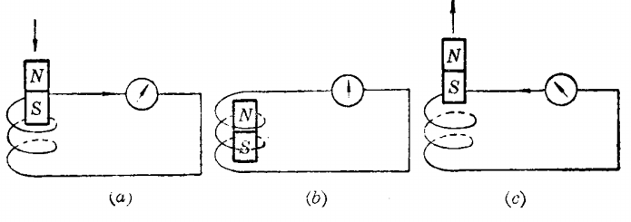
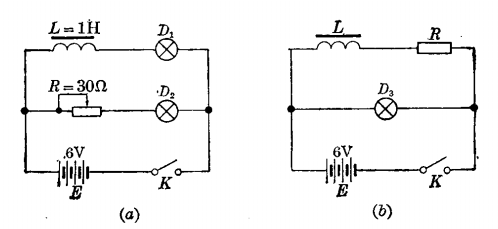
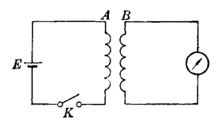

# 电磁

[TOC]

## 概述

通电导线周围与磁铁一样存在着磁场，这种现象称作电流的磁效应。

## 右手螺旋定则

通电导线周围的磁场方向由产生磁场的电流方向来决定，可用右手螺旋定则来判断。

若通电导线是直导线时，右手握住导线，使大拇指方向与导线电流方向一致，则弯曲四指即表示导线周围的磁场方向。

通电导线是螺管线圈时，用右手握住线圈，使弯曲四指的方向与线圈电流方向一致，则大拇指方向即表示线圈的磁场方向。

 

通电螺线管中电流越强或匝数越多，磁性越强。

## 磁势

要使线圈产生磁通，必须有磁势。电流与线圈匝数的乘积叫做磁势。磁势越大，产生的磁通越大，磁场越强。

单位：安培匝数，安匝

## 磁场强度

磁场强度，用 H 表示。

磁力线通过的闭合路径叫做磁路。
$$
\Huge H=\frac{IN}{\iota } 
$$

* H       磁场强度               安匝 / cm
* I         电流                       A
* N       匝数                       匝
* ι         磁路长度                cm

## 导磁系数

磁路材料的导磁系数，用字母 μ 表示。
$$
\Huge \mu =\frac{B}{H}=\frac{V\cdot s /m^{2} }{A/m}  =\frac{\Omega \cdot s}{m} =\frac{H}{m}
$$
导磁系数只与磁路材料有关，越大，说明材料的导磁性能越好，能够用较小的电流强度来产生较大的磁通密度。

| 物质             | 磁导率（大致数值）      |
| ---------------- | ----------------------- |
| 海平面的干燥空气 | 1.0                     |
| 铁磁性合金       | 3000 - 1 000 000        |
| 铝               | 稍大于1                 |
| 铋               | 稍大于1                 |
| 钴               | 60 - 70                 |
| 压制的铁粉       | 100 - 3000              |
| 固态精制铁       | 3000 - 8000             |
| 固态非精制铁     | 60 - 100                |
| 镍               | 50 - 60                 |
| 银               | 稍小于1                 |
| 钢               | 300 - 600               |
| 真空             | 1.0（准确值，根据定义） |
| 石蜡             | 稍小于1                 |
| 干燥的木材       | 稍小于1                 |

## 电磁铁

 

## 电磁感应

当线圈周围磁场发生变动时，在线圈中能产生电动势的现象叫做电磁感应。

由电磁感应产生的电动势叫做感应电动势，由感应电动势所形成的电流叫做感应电流。

 

线圈中感应电动势的大小是跟单位时间内穿过线圈的磁通量的变化成正比的，把这个规律叫做电磁感应定律。

N 匝线圈产生的感应电动势 e 可以用下列公式表示：
$$
\Huge e = K \cdot N \cdot \frac{\Delta \Phi }{\Delta t} 
$$

* e            感应电动势。

* K            比例常数，数值跟其他各个量的单位选择有关。

  ​               如果 Φ 的单位是麦克斯韦，t 的单位为 s ，e 的单位为

  ​               V ，则 K 为 10-8 。

* N            线圈匝数。

* Φ            穿过线圈的磁通量。

* t              时间。

## 自感

在开关未闭合时，线圈周围没有磁场，当线圈通电的一瞬间，电流从无到有，磁场也随着从无到有，当时就是磁场的变化。因线圈周围有磁场变化，在线圈中也会感应出电动势来。这种感应电动势叫做自感电动势。这种现象叫做自感现象。
$$
\Huge e = L\cdot \frac{\Delta I}{\Delta t} 
$$

* e      自感电动势
* L       自感系数，电感量         H
* I        电流                                 A
* t        时间                                 s

### 实际使用

* 电动机等带有线圈的设备，断电时需要防护，防止自感电动势。
* 日光灯的镇流器。

## 楞次定律

如下实验电路：

 

* a 图

  闭合开关，调整变阻器使两个灯一样亮。断开开关后重新闭合，在通电一瞬间，可发现 D1 比 D2 亮的慢一些。

* b 图

  闭合开关后，再断开开关，会发现灯在断开的一瞬间会比正常时更亮的一闪后熄灭，甚至还会因过亮而烧毁。

感应电动势的方向，总是使它所形成的感应电流产生另一个磁场来时刻阻止原有磁场的变化。

## 互感

如下实验电路：

 

任意两个邻近的线圈，其中一个的电流发生变化时，引起另一个产生感生电流的现象叫互感。

由另外一个线圈产生的变化磁场所感应出来的电动势，叫做互感电动势。
