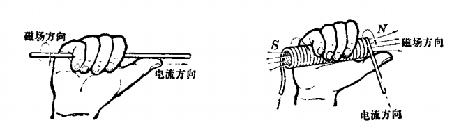
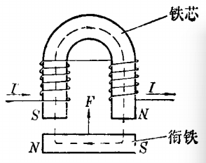

# 电磁

[TOC]

## 概述

通电导线周围与磁铁一样存在着磁场，这种现象称作电流的磁效应。

## 右手螺旋定则

通电导线周围的磁场方向由产生磁场的电流方向来决定，可用右手螺旋定则来判断。

若通电导线是直导线时，右手握住导线，使大拇指方向与导线电流方向一致，则弯曲四指即表示导线周围的磁场方向。

通电导线是螺管线圈时，用右手握住线圈，使弯曲四指的方向与线圈电流方向一致，则大拇指方向即表示线圈的磁场方向。

 

通电螺线管中电流越强或匝数越多，磁性越强。

## 磁势

要使线圈产生磁通，必须有磁势。电流与线圈匝数的乘积叫做磁势。磁势越大，产生的磁通越大，磁场越强。

单位：安培匝数，安匝

## 磁场强度

磁场强度，用 H 表示。

磁力线通过的闭合路径叫做磁路。
$$
\Huge H=\frac{IN}{\iota } 
$$

* H       磁场强度               安匝 / cm
* I         电流                       A
* N       匝数                       匝
* ι         磁路长度                cm

## 导磁系数

磁路材料的导磁系数，用字母 μ 表示。
$$
\Huge \mu =\frac{B}{H}=\frac{V\cdot s /m^{2} }{A/m}  =\frac{\Omega \cdot s}{m} =\frac{H}{m}
$$
导磁系数只与磁路材料有关，越大，说明材料的导磁性能越好，能够用较小的电流强度来产生较大的磁通密度。

| 物质             | 磁导率（大致数值）      |
| ---------------- | ----------------------- |
| 海平面的干燥空气 | 1.0                     |
| 铁磁性合金       | 3000 - 1 000 000        |
| 铝               | 稍大于1                 |
| 铋               | 稍大于1                 |
| 钴               | 60 - 70                 |
| 压制的铁粉       | 100 - 3000              |
| 固态精制铁       | 3000 - 8000             |
| 固态非精制铁     | 60 - 100                |
| 镍               | 50 - 60                 |
| 银               | 稍小于1                 |
| 钢               | 300 - 600               |
| 真空             | 1.0（准确值，根据定义） |
| 石蜡             | 稍小于1                 |
| 干燥的木材       | 稍小于1                 |

## 电磁铁

 
