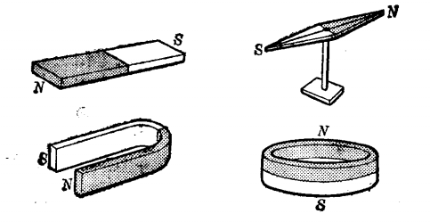
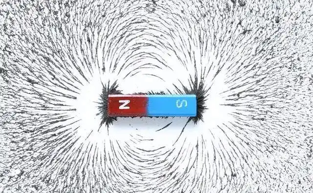
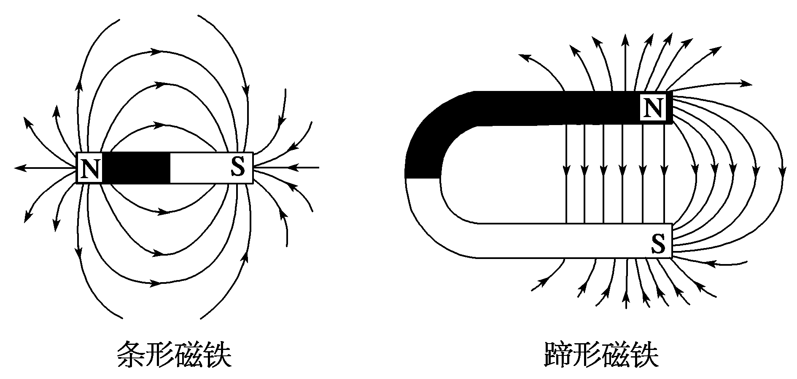

# 磁铁

[TOC]

## 概述

磁铁两端磁性强的区域称为磁极，一端称为北极（N 极），一端称为南极（S 极）。实验证明，同名磁极相互排斥，异名磁极相互吸引。

## 磁场

磁铁周围空间存在磁场。各处磁场的强弱是不相同的。

为研究问题的方便，用假想的磁力线来形象的表示磁场的强弱和方向。

把磁铁放在玻璃板下，在玻璃板上方撒些细铁屑，轻轻敲击玻璃板，细铁屑会在磁场的作用下排成线状，分布在磁铁周围的空间。

 

细铁屑的线状排列，显示了磁场中磁力线的形状。在磁力线密集的地方磁场较强，磁力线较稀疏的地方磁场较弱。

用磁力线可表示磁场的方向。磁体的磁力线是从 N 极出发，经过空间回到 S 极，在磁体内部，磁力线是从 S 极到 N 极。

磁力线是封闭的，而且不会相互交叉。在磁场中，某点的磁场方向，就是通过改点的磁力线的切线方向。

 

## 磁通量

穿过某一横截面积的磁力线条数，叫做穿过这个面积的磁通量。

符号：Φ

单位：麦克斯韦，麦

磁通量只能表示穿过某个横截面积的磁力线的多少，不能表示磁力线的疏密程度，即不能表示磁场的强弱。

## 磁感应强度

磁场的强弱由垂直穿过单位面积的磁力线条数来表示，叫做磁感应强度（又称磁通密度）。

符号：B

单位：高斯
$$
\Huge B= \frac{\Phi }{S}
$$

* B        磁感应强度      高斯
* Φ       导磁系数          麦克斯韦
* S        面积                  cm2
