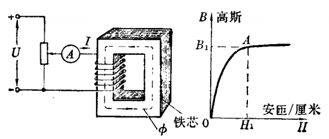
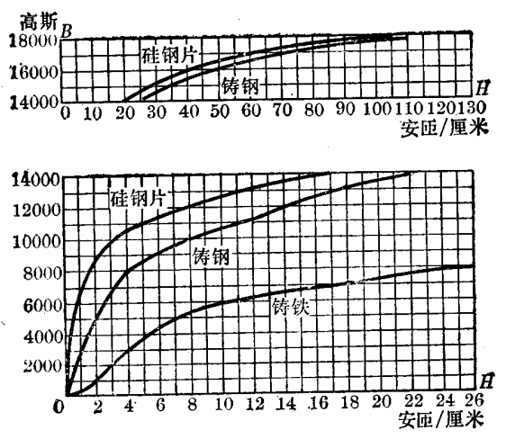

# 铁磁材料

[TOC]

## 分类

根据导磁性能的好坏，磁路材料可以分为两大类：

* 铁磁材料

  铁、钴、镍等，通常是指磁铁可以吸引的材料，导磁性能好，导磁系数大。

* 非铁磁材料

  除铁磁材料外的所有材料，导磁性能差，导磁系数小。

## 磁化

铁磁材料可以看作是许多小的分子磁铁组成，这些分子磁铁在外磁场作用下，很容易偏转到与外磁场一致的方向，这个过程称为磁化。

磁化后的铁磁材料对外产生很强的附加磁场，这个附加磁场会与空芯线圈通电后产生的磁场相叠加，因而铁芯线圈产生的磁场比空芯线圈的磁场增强很多倍。

磁化过程，磁化曲线：

 

当 H 增大到一定数值后，B 的增加开始显著减慢，这种现象称为饱和。

在开始磁化阶段，铁磁材料中有很多分子磁铁在外磁场的作用下按一定方向偏转排齐，因此附加磁场显著增强；当磁化到一定程度，分子磁铁基本上已按照一定方向排齐，附加磁场的增加非常有限。

 

## 剩磁

铁磁材料磁化后，如断开线圈，外磁场虽然消失，但由于铁磁材料中已经排齐的分子磁铁不会立即恢复到原来杂乱无章的状态，因此还会剩余一部分附加磁场，称为剩磁。

要消除剩磁，可在线圈中通入一定的反向电流来产生反向的磁场强度，这个反向磁场强度的大小称为铁磁材料的矫顽力。

## 磁滞损耗

线圈通入交流电，铁芯被反复磁化，由于其内部的分子磁铁要不断克服阻力，交替改变方向，消耗能量，并使铁芯发热，这种消耗的能量叫做磁滞损耗。

## 常见材料

### 软磁材料

硅钢片、铸钢、铸铁等。这类材料的导磁系数大，剩磁及矫顽力小，易磁化和去磁，因而磁滞损耗小。

* 硅钢片

  * 低硅钢片

    含硅量在 2.8 % 以下。用于旋转电机。含硅量在 1.8 ~ 2.8 % 之间，片厚 0.5 mm 。常见型号：

    * D22
    * D23
    * D24

  * 高硅钢片

    含硅量在 2.8 % 以上。比低硅钢片损耗低，质脆，机械强度差，一般用于静止的变压器中。含硅量在 3.81 ~ 4.80 % 之间，片厚 0.35 mm 。常见型号：

    * D41
    * D42
    * D43

  * 冷轧硅钢片

    导磁系数高，损耗低。常用型号：

    * D310
    * D320
    * D330

* 铁镍合金（波莫合金）

  导磁系数极大，矫顽力很小，常用来做高频变压器及脉冲变压器的铁芯。用于交流仪表中。

* 铁氧体

  反复磁化的频率越高，损耗越大。为减少损耗，在频率很高的电路中，用铁氧体做磁性材料。

### 硬磁材料

如碳钢、钴钢、铁钴镍合金以及恒磁性瓷等。

剩磁与矫顽力大，有很强的剩磁磁场。
